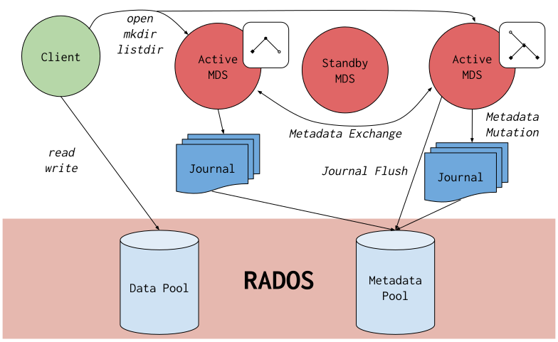

# CEPH 文件系统

Ceph 文件系统或CephFS是一个符合 POSIX 的文件系统，构建在 Ceph 的分布式对象存储RADOS之上。CephFS 致力于为各种应用程序提供最先进的、多用途、高可用性和高性能的文件存储。

文件元数据与文件数据存储在单独的 RADOS 池中，并通过可调整大小的元数据服务器集群/MDS提供服务，该集群可以扩展以支持更高吞吐量的元数据工作负载。文件系统的客户端可以直接访问 RADOS 以读取和写入文件数据块,工作负载可能会随着底层 RADOS 对象存储的大小而线性扩展。

对数据的访问是通过 MDS 集群来协调的，


CephFS 因其新颖的设计和对文件系统研究的贡献而成为众多学术论文的主题。它是 Ceph 中最古老的存储接口，曾经是 RADOS 的主要用例。现在它与另外两个存储接口相结合，形成了一个现代的统一存储系统：RBD（Ceph Block Devices）和RGW（Ceph Object Storage Gateway）。

## 创建 CEPH 文件系统

一个 Ceph 文件系统至少需要两个 RADOS 池，一个用于数据，一个用于元数据。

要使用默认设置创建两个用于文件系统的池: ceph osd pool create

```shell
ceph osd pool create cephfs_data
ceph osd pool create cephfs_metadata
```

启用文件系统：ceph fs new

```shell
ceph fs new <fs_name> <metadata> <data>

example:
ceph fs new cephfs cephfs_metadata cephfs_data

ceph fs ls

ceph mds stat
```

一旦创建了文件系统并且 MDS 处于活动状态，您就可以挂载文件系统了。如果您创建了多个文件系统，您将在挂载时选择使用哪个文件系统。

```note
文件系统、元数据池和数据池的名称只能包含集合中的字符 [a-zA-Z0-9_-.]
```

