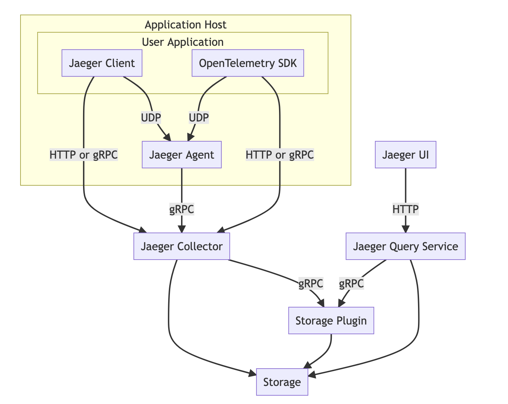

# OpenTracing


## Jaeger

Jaeger 是 Uber 推出的一款开源分布式追踪系统，兼容 OpenTracing API。

### Jaeger 架构



如上图所示，Jaeger 主要由以下几部分组成。

* Jaeger Client - 为不同语言实现了符合 OpenTracing 标准的 SDK。应用程序通过 API 写入数据，client library 把 trace 信息按照应用程序指定的采样策略传递给 jaeger-agent。
* Agent - 它是一个监听在 UDP 端口上接收 span 数据的网络守护进程，它会将数据批量发送给 collector。它被设计成一个基础组件，部署到所有的宿主机上。Agent 将 client library 和 collector 解耦，为 client library 屏蔽了路由和发现 collector 的细节。
* Collector - 接收 jaeger-agent 发送来的数据，然后将数据写入后端存储。Collector 被设计成无状态的组件，因此您可以同时运行任意数量的 jaeger-collector。
* Data Store - 后端存储被设计成一个可插拔的组件，支持将数据写入 cassandra、elastic search。
* Query - 接收查询请求，然后从后端存储系统中检索 trace 并通过 UI 进行展示。Query 是无状态的，您可以启动多个实例，把它们部署在 nginx 这样的负载均衡器后面。

### docker 部署

```sh
# elasticsearch
9200 作为 Http 协议，主要用于外部通讯
ES 集群之间是通过 9300 进行通讯。

docker run -d --name=elasticsearch -p 9200:9200 -p 9300:9300 -e "discovery.type=single-node" -e "xpack.security.enabled=false" -e ES_JAVA_OPTS="-Xms512m -Xmx512m"  docker.elastic.co/elasticsearch/elasticsearch:7.12.1

# kibana （可选）
docker run -d --name=kibana --link=elasticsearch -p 5601:5601
docker.elastic.co/kibana/kibana:8.3.2-amd64

# jaeger-collector 注意地址为es的地址
14267 tcp agent发送jaeger.thrift格式数据
14250 tcp agent发送proto格式数据（背后gRPC)
14268 http 直接接受客户端数据
14269 http 健康检查

docker run -d --name=jaeger-collector --link elasticsearch -p 9411:9411 -p 14250:14250 -p 14268:14268 -p 14269:14269 -e SPAN_STORAGE_TYPE=elasticsearch -e ES_SERVER_URLS=http://172.17.0.2:9200 jaegertracing/jaeger-collector

#使用启动容器名称 elasticsearch 或 localhost 作为访问地址，无法启动 jaeger-collector==提示无法访问 Elasticsearch ，但是本地使用 curl 语句正常访问
#使用 publish_address 作为访问地址:
# 查看 publish_address 
curl -XGET '0.0.0.0:9200/_nodes/http?pretty' | grep publish_address

# jaeger-agent 在lotus运行的主机上运行并将添加环境变量（需要重启lotus）
LOTUS_JAEGER_AGENT_HOST=jaeger
LOTUS_JAEGER_AGENT_PORT=6831

5775 UDP协议，接收兼容zipkin的协议数据
6831 UDP协议，接收兼容jaeger的兼容协议
6832 UDP协议，接收jaeger的二进制协议
5778 HTTP协议，数据量大不建议使用

docker run -d --name=jaeger-agent -p 6831:6831/udp -p 6832:6832/udp -p 5778:5778/tcp -p 5775:5775/udp -e REPORTER_GRPC_HOST_PORT=172.17.0.3:14250 -e LOG_LEVEL=debug jaegertracing/jaeger-agent

# jaeger-query 注意地址为es的地址
16686 http jaeger的前端，放给用户的接口
16687 http 健康检查

docker run -d --name=jaeger-query --link elasticsearch -p 16686:16686 -p 16687:16687 -e SPAN_STORAGE_TYPE=elasticsearch -e ES_SERVER_URLS=http://172.17.0.2:9200 jaegertracing/jaeger-query

# 列出容器
docker container ls

openstack user list

# 调试日志
docker inspect jaeger-agent | grep LogPath

# 停止并删除容器
docker container stop jaeger-collector jaeger-agent jaeger-query
docker container rm jaeger-collector jaeger-agent jaeger-query
```

### 查询数据

#### Jaeger UI

直接使用 Jaeger UI 查询，可以自定义日期范围。

#### kibana

用 kibana 可视化查询数据。

#### curl 

用 curl 查询 elasticsearch ，可以使用不同的参数过滤查询数据。

```sh
# 返回索引信息
curl -X GET "localhost:9200/_cat/indices?v"

# 查询索引包含 jaeger 的信息
curl -X GET "localhost:9200/jaeger*/_search?pretty" -H 'Content-Type: application/json' -d'
{
    "query": {
        "match_all": {}
    }
}
'
```

#### elasticdump

使用 elasticdump 导出数据，并保存为 json 格式的文件。

```sh
# 安装 elasticdump
curl -fsSL https://deb.nodesource.com/setup_14.x | sudo -E bash -
sudo apt-get install -y nodejs
sudo npm install elasticdump -g
elasticdump

# 以 json 格式导出数据
elasticdump --input="http://localhost:9200/jaeger-service-05-08" --output=service.json

elasticdump --input="http://localhost:9200/jaeger-span-05-08" --output=span.json
```