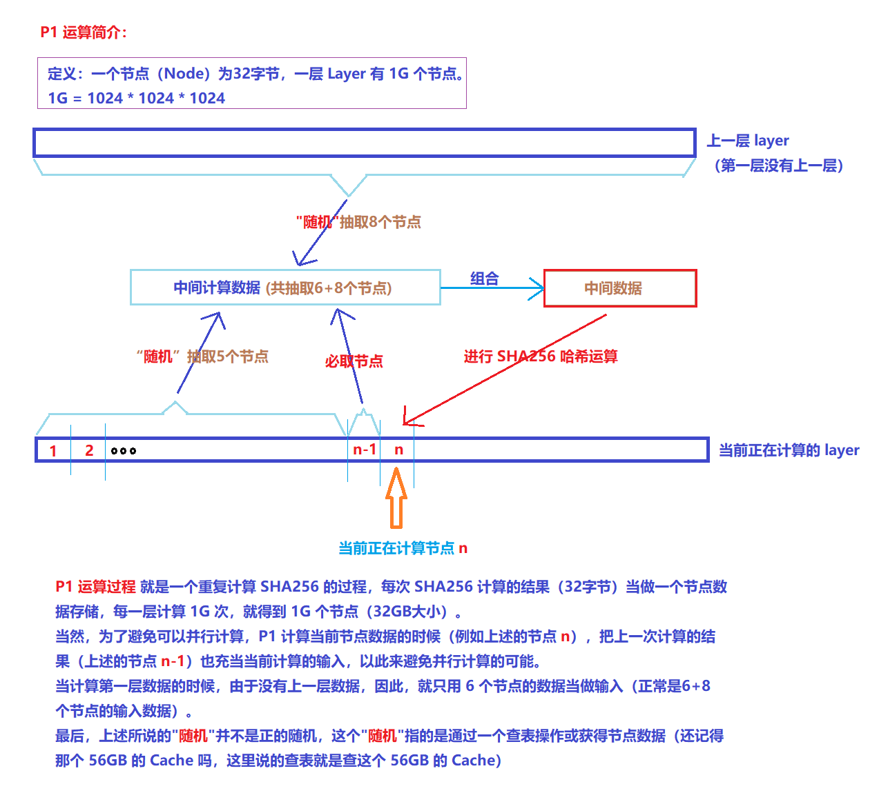

# 密封（Seal）流程简介

在使用 Sector 之前，矿工必须密封Sector：对 Sector 中的数据进行编码，为证明过程做好准备。

* 未密封扇区：原始数据的扇区。
  * `UnsealedCID (CommD)` : Unsealed Sector 的默克尔树的根哈希。也称为 CommD，或“`数据承诺`”。
* 密封扇区：已编码以准备验证过程的扇区。
  * `SealedCID (CommR)`：Sealed Sector 的默克尔树的根哈希。也称为 CommR，或“`副本承诺`”。

通过复制证明 (PoRep) 密封扇区是一个计算密集型过程，会产生扇区的唯一编码。一旦数据被密封，存储矿工：生成证明；在证明上运行 SNARK 以压缩它；最后，将压缩结果提交给区块链，作为存储承诺的证明。

lotus 密封一个扇区，通常需要经历以下几个过程：

* AddPiece (简称 AP) ：主要填充一个扇区，不耗时
* PreCommitPhase1 (简称 PC1) ： 进行大量的、不可并行的哈希计算（使用 SHA256 哈希算法），非常耗时
* PreCommitPhase2 (简称 PC2) ： 进行大量的、可并行的哈希计算（使用 Poseidon 哈希算法），比较耗时
* CommitPhase1 (简称 C1) : 做一些检查和配置，没有实际计算，不耗时
* CommitPhase2 (简称 C2) ： 做存储证明（PoRep）过程，比较耗时

## AP 计算过程

## PC1 计算过程

对于 32GB 的扇区，P1 计算过程是生成 11 层数据，每层数据都是 32GB 大小，并且除了第一层之外，剩下的 10 层数据的生成过程是完全一样的。 这里涉及到一个节点的概念，其实就是把一个 32 字节的数据当做一个节点，一层 Layer 由 1G（1G=1024*1024*1024） 个连续的节点组成，仅此而已。

## PC2 计算过程

P2 的运算过程其实也很简单，只是使用的哈希算法是 Poseidon 哈希算法而已，本质上还是进行哈希运算。 P2 分为两个阶段，一个是 Building column hash（也叫做 Building tree c），另一个叫做 Building tree r last。 只不过，在 Building column hash 的时候，会把每层的 1G 个节点的划分为大小相等的 8 份，每一份都是 128M 个节点，最后生成一个 8 个 tree-c（tree-c-0 ~ tree-c-7）（下图为了简洁，没有体现划分 8 份的操作）。 Building tree r last 和 Building column hash 基本一样，只是使用的数据不一样罢了，最后生成 tree-r-last-0 ~ tree-r-last-7。

PC2 的过程可以进行大规模的并行运算，前后没有依赖关系，因此，更适合使用显卡进行计算，唯一需要克服的一点就是：从磁盘读取大量数据并传输到显存的过程。

## C1 计算过程

## C2 计算过程
