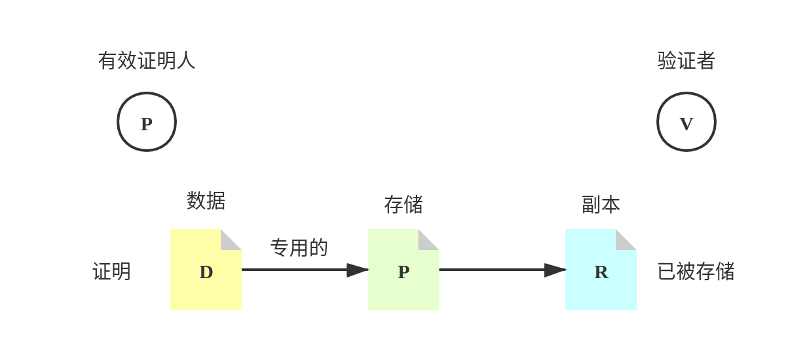
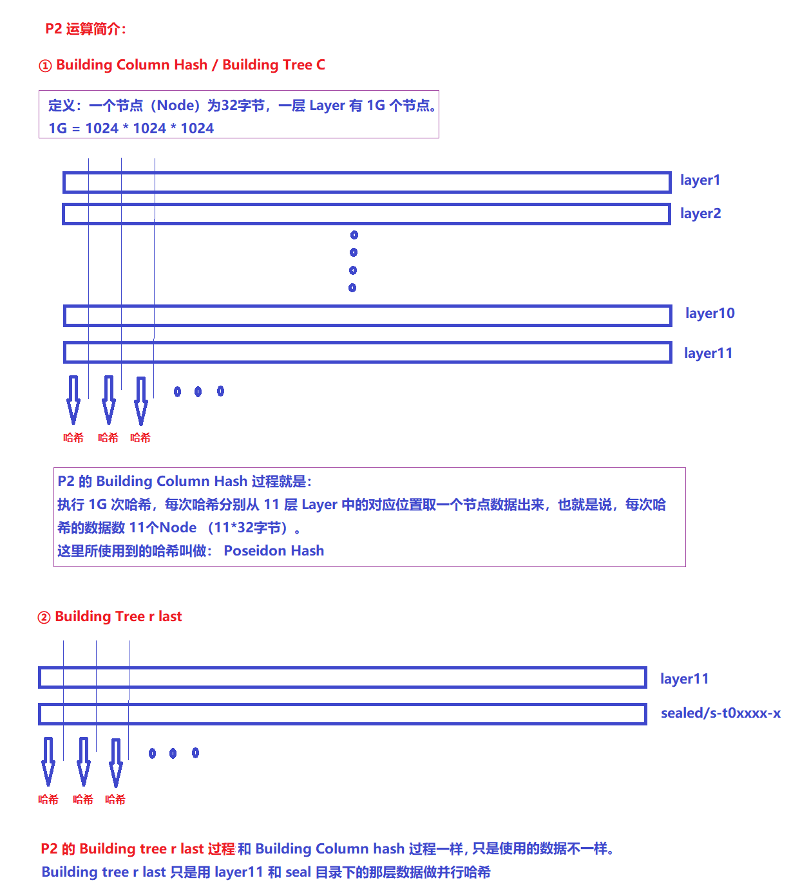

# FileCoin封装

## 项目目录

### api

    为Lotus命令提供后台服务，多数命令都需要与后台服务进行通信，这些命令通常会涉及到链上数据。本目录抽象了节点定义，定义了若干go interface，如 Common（定义节点通用功能）、FullNode （定义一个全节点的行为，继承自Common）、StorageMiner（存储矿工，也从Common继承）和相关的函数。

    对应于上面几种主要接口，也提供了几个struct，分别为CommonStruct，FullNodeStruct，StorageMinerStruct作为实现，这些实现使用了代理模式，只是简单地将请求转发给各自的Internal成员，具体的功能函数需要使用者提供。

### build
    定义用于构建节点的函数，其中包括了： 从受信节点获取启动相关参数（位于paramfetch.go），生成内置的创世区块（位于genesis.go）等。

### genesis
    内置的创世区块数据

### chain
    实现与链的交互功能

### actors
    Filecoin网络内建的各种actor定义

### types
    定义Filecoin中的各种数据结构

### store
    公链存储相关，处理所有的本地链状态，包括链头、消息和状态等

### state
    处理Filecoin的状态树

### vm
    Filecoin虚拟机

### cli
    Lotus命令行工具的实现

### cmd
    内含各种不同的命令行项目，Lotus将系统分为不同的进程模块，为每个模块定义一个项目：	
|目录	|项目	|说明|
|---|---|---|
|lotus	|守护进程	|负责公链上数据的同步，与公链进行交互等，是lotus的主要进程之一
|lotus-bench	|基准测试工具	
|lotus-storage-miner|	挖矿进程	|打包信息到区块，存储矿工
|lotus-seal-worker	|密封数据进程	|密封数据是挖矿过程中必不可少的一环，本进程即实现此功能
### lib 
    实现lotus项目各模块公用的函数：
|名称	|功能描述|
|---|---|
|crypto	|实现数据加密，公钥生成，签名与签名验证等
|jsonrpc	|实现了一个基于json传输数据的rpc包，包括服务端和客户端，可为其它项目提供完整的rpc功能支持
|statestore	|包装github.com/ipfs/go-datastore，实现状态追踪
|sectorbuilder	|实现扇区管理
|bufstore	|集成了Blockstore的读写功能
|cborutil	|提供操作cbor数据的简便方法
|auth	|实现权限认证服务HTTP接口

### lotuspond

    Pond项目目录，Pond是一个用于管理Lotus的UI工具，可用于建立一个独立的本地网络以方便调试。Pond会启动节点，使用指定的拓扑进行连接，启动挖矿，并持续监控节点运行状况。

### miner

    定义产出区块逻辑，与全节点通过API进行交互

### node

    定义了lotus节点相关的struct和interface等，各主要子目录如下：

    hello:实现hello协议
    modules:定义实现节点功能的各种函数
    scripts
    各种运行脚本，用于布暑节点和矿工等，也包括一些用于启动的配置文件

### storage

    定义存储矿工逻辑，用于实现"lotus-storage-miner"

### blockstore
    Blockstore 是 Lotus 使用的块存储接口。 它是基本的 go-ipfs 块存储与 Lotus 所需的其他功能的结合，例如 查看或同步。

### system
    操作系统的资源占用情况

resources.go
```go
package system

import (
    "os"

    "github.com/dustin/go-humanize"
    "github.com/elastic/gosigar"
    logging "github.com/ipfs/go-log/v2"
)

var (
    logSystem = logging.Logger("system")
)

// EnvMaximumHeap is name of the environment variable with which the user can
// specify a maximum heap size to abide by. The value of the env variable should
// be in bytes, or in SI bytes (e.g. 32GiB).
const EnvMaximumHeap = "LOTUS_MAX_HEAP"

// MemoryConstraints represents resource constraints that Lotus and the go
// runtime should abide by. It is a singleton object that's populated on
// initialization, and can be used by components for size calculations
// (e.g. caches).
type MemoryConstraints struct {
    // MaxHeapMem is the maximum heap memory that has been set by the user
    // through the LOTUS_MAX_HEAP env variable. If zero, there is no max heap
    // limit set.
    MaxHeapMem uint64

    // TotalSystemMem is the total system memory as reported by go-sigar. If
    // zero, it was impossible to determine the total system memory.
    TotalSystemMem uint64

    // EffectiveMemLimit is the memory limit in effect, in bytes.
    //
    // In order of precedence:
    //  1. MaxHeapMem if non-zero.
    //  2. TotalSystemMem if non-zero.
    //  3. Zero (no known limit).
    EffectiveMemLimit uint64
}

// GetMemoryConstraints returns the memory constraints for this process.
func GetMemoryConstraints() (ret MemoryConstraints) {
    var mem gosigar.Mem
    if err := mem.Get(); err != nil {
        logSystem.Warnf("failed to acquire total system memory: %s", err)
    } else {
        ret.TotalSystemMem = mem.Total
        ret.EffectiveMemLimit = mem.Total
    }

    if v := os.Getenv(EnvMaximumHeap); v != "" {
        bytes, err := humanize.ParseBytes(v)
        if err != nil {
            logSystem.Warnf("failed to parse %s env variable with value %s: %s; ignoring max heap limit", EnvMaximumHeap, v, err)
        } else {
            ret.MaxHeapMem = bytes
            ret.EffectiveMemLimit = bytes
        }
    }
    return ret
}
```
### testplans
    一些测试相关的内容

### tools
    一些相关工具库


## 原理解析

### PoRep算法解析
PoRep方案的核心流程，是有效证明人P说服验证者V，数据D的一个P专用的独立物理副本R已经被存储。其协议是一个多项式时间算法的原组
(Setup、Prove、Verify)。

1. PoRep.Setup 目标是生成副本Replica R
   1. 同时给予P、V必要的计算信息，以便后续的Prove、Verify可以进行。 
   2. 这些信息是R的Merkle证明根，Root[R]和证明Proof(R,SEAL)。
   3. PoRep.Prove，目标是生成一个证明，证明在PoRep.Setup阶段，Setup算法通过SEAL密封算法，生成一个副本R，并且提供副本的证明Proof(πSEAL)。这个证明由证明人输出，发给验证者。注意，R不需要发给验证者。
    ```sh
    Inputs：
    -证明秘钥对(prover key pair):(pkP,skP)。
    -密封证明私钥prover SEAL key: pkSEAL，这个和密封验证证明秘钥是一对。
    -data D。这个是32G输入数据

    Outputs：
    -副本Replica R。
    -R的默克尔证明根MerkleCRH，Merkle root rt of R
    -证明Proof：πSEAL

    Setup阶段的计算过程包括：
    1. 计算hD=CRH(D)，计算D的CRH 哈希值。
    2. 计算R=Seal(D,skP)
    3. 计算rt=MerkleCRH(R)
    4. x=(pkP,hD,rt),w=(skp,D)
    5. 计算πSEAL=SCIP.Prove(pkSEAL,x,w)
    ```
2. PoRep.Prover阶段
   
   1. Prover算法生成副本R的存储证明Proof(πPOS)。
   2. 证明这收到来自验证者的随机挑战C，要求在树根为rt的Merkle树R中确认特定叶子节点Rc。
   3. 证明人生成从树根rt到叶子Rc的路径的知识证明来证明这点。
    ```sh
    Inputs：
    -存储证明私钥(prover Proof-of-Storage key):(pkPOS)。这个和存储验证证明秘钥是一对。
    -副本Replica R。 
    -随机挑战random challenge C。

    Outputs：
    -证明Proof：πPOS

    Prover阶段的计算过程包括：
    1. 计算rt=MerkleCRH(R)，计算R的Merkle CRH 哈希值。
    2. 计算path=从 叶子Rc到rt的Merkle路径
    3. x=(rt，c),w=(path,Rc)
    4. 计算πPOS=SCIP.Prove(pkPOS,x,w) 
    ```
3. PoRep.Verify阶段

   Verify算法检查前面两个证明Proof(πSEAL)和Proof(πPOS)的有效性。证明本身是可以公开验证的。
    ```sh
    Inputs：
    -证明公钥 prover public key,pkP。
    -SEAL/POS验证证明秘钥：vkSEAL/vkPOS
    -数据D的hash，hD。
    -R的默克尔证明根MerkleCRH，Merkle root rt of R。 
    -随机挑战random challenge C。
    -证明Proof(πSEAL)和Proof(πPOS)

    Outputs：
    -bit b。验证成功结果为1

    Verify阶段的计算过程包括:
    1. x=(pkp,hd,rt)
    2. 计算b1=SCIP.Verify(vkSEAL,x,πSEAL) 
    3. x=(c,rt)
    4. 计算b2=SCIP.Verify(vkPOS,x,πPOS)  
    5. output b1 and b2
    ```
### PoRep实现架构

在具体实现中，PoRep的Setup/Prover/Verify，可以分解成如下4个阶段。

1. Sealing preCommit的阶段1（P1）
   
   对于 32GB 的扇区，P1 计算过程是生成 11 层数据，每层数据都是 32GB 大小，并且除了第一层之外，剩下的 10 层数据的生成过程是完全一样的。 这里涉及到一个节点的概念，其实就是把一个 32 字节的数据当做一个节点，一层 Layer 由 1G（1G=1024*1024*1024） 个连续的节点(为什么要分割成节点，因为DRG。有了节点，才能按照图，确定节点和节点之间的关系)组成，仅此而已。SDR的计算依赖6个自身节点和8个扩展节点。所有的11层的计算，一层一层，一个个的按顺序进行计算。Lotus源代码对目前的SDR的实现进行了一定的优化，依赖关系的cache，依赖节点的数据的预读取以及sha256的加速。
   

    ```sh
    在P1阶段，复制证明的SDR算法会进行编码运算。可以分解成2部分的计算。
    1. 计算原始数据的merkle树（二叉树，sha256 hash计算）
    2. label，也就是SDR的计算。
    原始数据的merkle树（tree_d），树根为comm_d。
    注意：由于SDR的算法特性，SDR的计算目前官网是采用CPU直接计算的，其计算效率和系统的CPU性能有关，是单线程运算（不能进行并行运算）。
    这个阶段可能会长达若干小时，具体花费的时间和所封装扇区的大小及机器的配置有关。 
    协议实验室的相应评估报告，支持SHA功能的AMD处理器在这方面有很大的优势，并且CPU的频率越高越好。
    这个原因是AMD高端CPU直接带SHA加速指令。 
    ```
2. Sealing preCommit的阶段2（P2）
   
   P2 的运算过程其实也很简单，只是使用的哈希算法是 Poseidon 哈希算法而已，本质上还是进行哈希运算。 P2 分为两个阶段，一个是 Building column hash（也叫做 Building tree c），另一个叫做 Building tree r last。 只不过，在 Building column hash 的时候，会把每层的 1G 个节点的划分为大小相等的 8 份，每一份都是 128M 个节点，最后生成一个 8 个 tree-c（tree-c-0 - tree-c-7）（下图为了简洁，没有体现划分 8 份的操作）。 Building tree r last 和 Building column hash 基本一样，只是使用的数据不一样罢了，最后生成 tree-r-last-0 - tree-r-last-7。

   

   PC2 的过程可以进行大规模的并行运算，前后没有依赖关系，因此，更适合使用显卡进行计算，唯一需要克服的一点就是：从磁盘读取大量数据并传输到显存的过程。

    ```sh
    在P2 阶段，系统要用到Poseidon哈希算法产生默克尔树。可以分解成如下3个部分的计算。
    1. column hash 
    2. 针对column hash的计算结果生成merkle树（八叉树，poseidon hash计算）
    3. 针对label的计算结果，再做一次encoding，生成merkle树（八叉树，poseidon hash计算）。
    注意：这个阶段因为支持并行。官方推荐采用GPU实现。效率和系统GPU的性能有关，也可以用CPU替代GPU，但性能就差很多。
    ```
3. Sealing Commit的阶段1（C1）
    ```sh
    C1是个过渡阶段，它为后续的证明工作进行各项准备工作，其性能与CPU有关，通常花费几十秒。
    ```
4. Sealing Commit的阶段2（C2）
    ```sh
    这个封装过程要进行零知识证明运算，它会对前面产生的结果再次进行压缩，然后将其广播到区块链。
    注意：这个过程支持并行计算，极度依赖GPU，通常要花费20至30分钟。 
    协议实验室发现，P2、C1和C2这三个阶段可以在算力配置强，配置GPU的同一台机器上运行。

    但是在preCommit阶段1和preCommit阶段2之间会进行大量的文件传输，主要是P1阶段的原始阶段SDR数据。
    对32GB的Seal单元来说，至少需要352G的SDR。

    如果处理这两个阶段的机器网络性能差，或者存储设备使用的是普通硬盘而非固态硬盘则会大大降低系统的整体效率。 
    注意：SDR 352G文件在P2和C2的处理，如果可以考虑和P1合并进行预计算。
    这样在不影响集群架构的情况下，降低网络数据传输要求。
    ```

### 时空证明 PoSt

|步骤	|描述	|相关硬件	|耗时	|详述|
|---|---|---|---|---|
|Window-PoSt	|审核旷工的存储承诺	|GPU	|30分钟内(24小时至少1次/每个扇区)	|多核CPU可加速，8核勉强过关，24核轻松过关
|Winning-PoSt	|在每一个epoch提交存力证明以获得挖出区块的机会	|GPU	|1个epoch内完成，目前为25s	|不需太多计算

## 源码解析

### 参数设置

```rust
FIL_PROOFS_GPU_FRAMEWORK=cuda

// This value is defaulted to 2048 nodes, which is the equivalent of 112KiB of resident memory 
// (where each cached node consists of DEGREE (base + exp = 6 + 8) x 4 byte elements = 56 bytes in length)
// 计算伪随机队列输出缓存，常驻内存。
FIL_PROOFS_SDR_PARENTS_CACHE_SIZE=2048 

// default:/var/tmp/filecoin-parents
// set:/path/to/parent/cache/filecoin-parents
{
    // 优先级更高
    FIL_PROOFS_PARENT_CACHE=/path/to/parent/cache  
    // 只能通过环境变量设置
    FIL_PROOFS_CACHE_DIR=/path/to/parent/cache 
    // 是否检查文件数据的完整性（第一次访问）
    //（the manifest in storage-proofs/porep/parent-cache.json）
    // they will be automatically re-generated at runtime. If that cache generation fails, it will be reported as an error.
    FIL_PROOFS_VERIFY_CACHE=1
}

//multicore sdr enable.
FIL_PROOFS_USE_MULTICORE_SDR=1
// 
FIL_PROOFS_PARENT_CACHE_SIZE = 
// This is the number of worker threads loading node parents in parallel. 
// The default is 3
FIL_PROOFS_MULTICORE_SDR_PRODUCERS = 3  
// This is the (max) number of nodes for which a producer thread will load parents in each iteration of its loop. 
// The default is 128.
FIL_PROOFS_MULTICORE_SDR_PRODUCER_STRIDE = 128
// This is the size of the lookahead buffer into which node parents are pre-loaded by the producer threads. 
// The default is 800.
FIL_PROOFS_MULTICORE_SDR_LOOKAHEAD = 800
//Filecoin proof parameter files are located in the location
FIL_PROOFS_PARAMETER_CACHE=/path/to/parameters

Settings {
            verify_cache: false,
            verify_production_params: false,
            use_gpu_column_builder: false,
            max_gpu_column_batch_size: 400_000,
            column_write_batch_size: 262_144,
            use_gpu_tree_builder: false,
            max_gpu_tree_batch_size: 700_000,
            rows_to_discard: 2,
            sdr_parents_cache_size: 2_048,
            window_post_synthesis_num_cpus: num_cpus::get() as u32,
            // `parameter_cache` does not use the cache() mechanism because it is now used
            // for durable, canonical Groth parameters and verifying keys.
            // The name is retained for backwards compatibility.
            parameter_cache: "/var/tmp/filecoin-proof-parameters/".to_string(),
            parent_cache: cache("filecoin-parents"),
            use_multicore_sdr: false,
            multicore_sdr_producers: 3,
            multicore_sdr_producer_stride: 128,
            multicore_sdr_lookahead: 800,
        }


```

### 填充一个扇区

```rust
/// # Arguments
///
/// * `source` - a readable source of unprocessed piece bytes.
/// * `target` - a writer where we will write the processed piece bytes.
/// * `piece_size` - the number of unpadded user-bytes which can be read from source before EOF.
/// * `piece_lengths` - the number of bytes for each previous piece in the sector.
pub fn add_piece<R, W>(
    source: R,
    target: W,
    piece_size: UnpaddedBytesAmount,
    piece_lengths: &[UnpaddedBytesAmount],
) -> Result<(PieceInfo, UnpaddedBytesAmount)>
where
    R: Read,
    W: Write,
{
    trace!("add_piece:start");
    //函数式编程
    let result = measure_op(Operation::AddPiece, || {
        ensure_piece_size(piece_size)?;

        //覆盖为带缓存的
        let source = BufReader::new(source);
        let mut target = BufWriter::new(target);

        let written_bytes = sum_piece_bytes_with_alignment(piece_lengths);
        let piece_alignment = get_piece_alignment(written_bytes, piece_size);
        let fr32_reader = Fr32Reader::new(source);

        // write left alignment
        for _ in 0..usize::from(PaddedBytesAmount::from(piece_alignment.left_bytes)) {
            target.write_all(&[0u8][..])?;
        }

        let mut commitment_reader = CommitmentReader::new(fr32_reader);
        let n = io::copy(&mut commitment_reader, &mut target)
            .context("failed to write and preprocess bytes")?;

        ensure!(n != 0, "add_piece: read 0 bytes before EOF from source");
        let n = PaddedBytesAmount(n as u64);
        let n: UnpaddedBytesAmount = n.into();

        ensure!(n == piece_size, "add_piece: invalid bytes amount written");

        // write right alignment
        for _ in 0..usize::from(PaddedBytesAmount::from(piece_alignment.right_bytes)) {
            target.write_all(&[0u8][..])?;
        }

        let commitment = commitment_reader.finish()?;
        let mut comm = [0u8; 32];
        comm.copy_from_slice(commitment.as_ref());

        let written = piece_alignment.left_bytes + piece_alignment.right_bytes + piece_size;

        Ok((PieceInfo::new(comm, n)?, written))
    });

    trace!("add_piece:finish");
    result
}
```

### 不可并行的哈希计算

```rust
//使用 SHA256 哈希算法
pub fn seal_pre_commit_phase1<R, S, T, Tree: 'static + MerkleTreeTrait>(
    porep_config: PoRepConfig,
    cache_path: R,
    in_path: S,
    out_path: T,
    prover_id: ProverId,
    sector_id: SectorId,
    ticket: Ticket,
    piece_infos: &[PieceInfo],
) -> Result<SealPreCommitPhase1Output<Tree>>
where
    R: AsRef<Path>,
    S: AsRef<Path>,
    T: AsRef<Path>;
// 生成逻辑
{
    // 生成compound_setup_params:
    pub struct stacked::SetupParams {
        pub nodes: usize,
        pub degree: usize,
        pub expansion_degree: usize,
        pub porep_id: [u8; 32],
        pub layer_challenges: LayerChallenges,
        pub api_version: ApiVersion,
    }
    pub struct compound_proof::SetupParams<'a, S: ProofScheme<'a>> {
        pub vanilla_params: <S as ProofScheme<'a>>::SetupParams,
        pub partitions: Option<usize>,
        pub priority: bool,
    }

    //由compound_setup_params生成compound_public_params
    pub struct drgraph::BucketGraph<H: Hasher> {
        nodes: usize,
        base_degree: usize,
        seed: [u8; 28],
        api_version: ApiVersion,
        _h: PhantomData<H>,
    }

    pub struct StackedGraph<H, G>
    where
        H: Hasher,
        G: Graph<H> + 'static,
    {
        expansion_degree: usize,
        base_graph: G,
        pub(crate) feistel_keys: [feistel::Index; 4],
        feistel_precomputed: FeistelPrecomputed,
        api_version: ApiVersion,
        id: String,
        _h: PhantomData<H>,
    }

    pub struct PublicParams<Tree>
    where
        Tree: 'static + MerkleTreeTrait,
    {
        pub graph: StackedBucketGraph<Tree::Hasher>,
        pub layer_challenges: LayerChallenges,
        _t: PhantomData<Tree>,
    }

    pub struct PublicParams<'a, S: ProofScheme<'a>> {
        pub vanilla_params: S::PublicParams,
        pub partitions: Option<usize>,
        pub priority: bool,
    }
}
//总结:对于porep_config一样的配置，生成的compound_public_params就一样

{
    //生成merkle_tree获取comm_d
}
//总结:数据一致，comm_d一致

{

    struct IncrementingCursor {
        cur: AtomicUsize,
        cur_safe: AtomicUsize,
    }
    pub struct CacheReader<T> {
        file: File,
        bufs: UnsafeCell<[Mmap; 2]>,
        size: usize,
        degree: usize,
        window_size: usize,
        cursor: IncrementingCursor,
        consumer: AtomicU64,
        _t: PhantomData<T>,
    }

    

}
//总结:


// 使用 Poseidon 哈希算法生成Merkle树
pub fn seal_pre_commit_phase2<R, S, Tree: 'static + MerkleTreeTrait>(
    porep_config: PoRepConfig,
    phase1_output: SealPreCommitPhase1Output<Tree>,
    cache_path: S,
    replica_path: R,
) -> Result<SealPreCommitOutput>
where
    R: AsRef<Path>,
    S: AsRef<Path>;
```

#### seal_pre_commit_phase1

1. 为原始数据生成merkle tree.
2. 验证数据.
3. 生成labels.


### 存储证明

```rust

//准备好生成证明
pub fn seal_commit_phase1<T: AsRef<Path>, Tree: 'static + MerkleTreeTrait>(
    porep_config: PoRepConfig,
    cache_path: T,
    replica_path: T,
    prover_id: ProverId,
    sector_id: SectorId,
    ticket: Ticket,
    seed: Ticket,
    pre_commit: SealPreCommitOutput,
    piece_infos: &[PieceInfo],
) -> Result<SealCommitPhase1Output<Tree>>;

//生成 zk-SNARK零知识证明
pub fn seal_commit_phase2<Tree: 'static + MerkleTreeTrait>(
    porep_config: PoRepConfig,
    phase1_output: SealCommitPhase1Output<Tree>,
    prover_id: ProverId,
    sector_id: SectorId,
) -> Result<SealCommitOutput>;

```

#### P1封装io流程

1. 将 unsealed 文件夹里的文件拷贝到 sealed 文件夹里，并设置文件长度为指定 sector size。
```rust
// Copy unsealed data to output location, where it will be sealed in place.
    fs::copy(&in_path, &out_path).with_context(|| {
        format!(
            "could not copy in_path={:?} to out_path={:?}",
            in_path.as_ref().display(),
            out_path.as_ref().display()
        )
    })?;
```


2. 将 sealed 中待封装的文件使用mmap映射到用户空间
```rust
let f_data = OpenOptions::new()
        .read(true)
        .write(true)
        .open(&out_path)
        .with_context(|| format!("could not open out_path={:?}", out_path.as_ref().display()))?;

    // Zero-pad the data to the requested size by extending the underlying file if needed.
    f_data.set_len(sector_bytes as u64)?;

    let data = unsafe {
        MmapOptions::new()
            .map_mut(&f_data)
            .with_context(|| format!("could not mmap out_path={:?}", out_path.as_ref().display()))?
    };
```
3. 计算merkle base tree,并unmap sealed 中文件映射
```rust
let data_tree = create_base_merkle_tree::<BinaryMerkleTree<DefaultPieceHasher>>(
            Some(config.clone()),
            base_tree_leafs,
            &data,
        )?;
        drop(data);
```
4. 计算 replica_id
5. 在 cached 文件夹中分层计算
```rust
   let labels = StackedDrg::<Tree, DefaultPieceHasher>::replicate_phase1(
        &compound_public_params.vanilla_params,
        &replica_id,
        config.clone(),
    )?;
```
6. 


### Merkle树

```rust
// 对 Merkle 树的构建和存储方式进行抽象
/// Trait used to abstract over the way Merkle Trees are constructed and stored.
pub trait MerkleTreeTrait: Send + Sync + Debug {
    type Arity: 'static + PoseidonArity;
    type SubTreeArity: 'static + PoseidonArity;
    type TopTreeArity: 'static + PoseidonArity;
    type Hasher: 'static + Hasher;
    type Store: Store<<Self::Hasher as Hasher>::Domain>;
    type Proof: MerkleProofTrait<
        Hasher = Self::Hasher,
        Arity = Self::Arity,
        SubTreeArity = Self::SubTreeArity,
        TopTreeArity = Self::TopTreeArity,
    >;

    /// Print a unique name for this configuration.
    fn display() -> String;
    /// Returns the root hash of the tree.
    fn root(&self) -> <Self::Hasher as Hasher>::Domain;
    /// Creates a merkle proof of the node at the given index.
    fn gen_proof(&self, index: usize) -> Result<Self::Proof>;
    fn gen_cached_proof(&self, i: usize, rows_to_discard: Option<usize>) -> Result<Self::Proof>;
    fn row_count(&self) -> usize;
    fn leaves(&self) -> usize;
    fn from_merkle(
        tree: MerkleTree<
            <Self::Hasher as Hasher>::Domain,
            <Self::Hasher as Hasher>::Function,
            Self::Store,
            Self::Arity,
            Self::SubTreeArity,
            Self::TopTreeArity,
        >,
    ) -> Self;
}
```