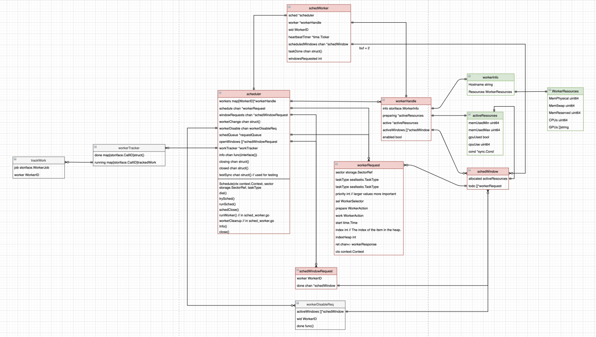

# FileCoin调度

## lotus 任务调度要解决的主要问题

    通过阅读 lotus 调度相关的代码发现，lotus 的调度任务实现得比较复杂，使用了十几个数据结构，代码也分布在数十个文件中，做这么多工作，当然有它的原因，它想要解决的主要问题包括：
    1. 实现任务绑定配置化。通过启动参数，可以灵活配置 worker 执行的任务种类，方便矿工进行灵活的集群架构调整，并实现集群机器数量的伸缩性；
    2. 根据硬件资源分发任务。不同配置的 worker 能够并行执行的任务数量也不相同，超过硬件承受能力的任务分配会导致硬件资源争用，进而导致任务执行时间直线下降。同时要均匀分配负载，不能让忙的忙死，闲的闲死；
    3. 兼容各种异常情况。例如当发生 worker 或 miner 突然掉线、网络不畅、存储空间不足等情况时，要能够保证异常状态的任务不会陷入死循环中，能够在合适的时间重启或继续，并且不影响正常状态任务的执行。

在实际使用中发现，尽管第二和第三个问题解决的不尽完美，但当前的方案已经基本适应了大多数场景。

## 调度核心流程


如上图所示：

1. worker 启动后，会通过 RPC 连接 miner，miner 收到并通过 JWT 验证后，会将其抽象为一个 workerHandle 对象，主要记录 worker 的基本信息，如资源使用情况、当前任务情况等；
2. workerHandle 对象会添加到名为 worker 的 map 中，用于后续任务调度时匹配；
3. 新增的 task 会抽象为 workerRequest，并添加到 miner 的任务队列中；
4. 这一步是调度的核心。将所有待调度的 task 依次寻找最优的 workerHandle，目前的实现主要参考任务优先级、worker 空闲情况、worker 每一个任务分配时需要预留的资源定义在 extern/sector-storage/resources.go文件中，如 32G 扇区需要预留资源如下：

| 任务类型 | MaxMemory | MinMemory | 最大并行数 | BaseMinMemory | canGPU |
| -------- | --------- | --------- | ---------- | ------------- | ------ |
| P1       | 64GB      | 56GB      | 不可并行   | 10MB          |        |
| P2       | 15GB      | 15GB      | 可并行     | 1GB           | true   |
| C1       | 1GB       | 1GB       | 未定义     | 1GB           |        |
| C2       | 150GB     | 30GB      | 可并行     | 32GB          | true   |

5. 匹配好 worker 的 task 下发到对应的 worker 上，worker 同时维护多个任务 window（类似 queue），用于保存及调度所有正在运行及待运行的任务；
6. worker 定期会到 window 中取出任务进行执行；
7. 执行任务计算。
   

## 基本数据结构



图中红色部分负责**核心调度**，绿色为**资源管理**，灰色负责**状态同步**记录。
核心数据结构包括：

* scheduler：调度器，负责在 miner 上统筹调度所有task及worker。核心调度方法是 trySched()
* workerHandle: worker 的抽象，记录 worker 基本信息、当前资源使用、worker 的任务 window 等
* workerRequest: task 的抽象，记录任务类型、优先级以及任务的具体执行内容等
* activeResources: 正在使用的资源
* workerResources: worker 总的资源

## 源码解析

```go
type Manager struct {
	// interface
	ls         paths.LocalStorage 
	// interface
	storage    paths.Store
	// struct
	localStore *paths.Local
	remoteHnd  *paths.FetchHandler
	//interface
	index      paths.SectorIndex

	sched            *Scheduler
	windowPoStSched  *poStScheduler
	winningPoStSched *poStScheduler

	localProver storiface.ProverPoSt

	workLk sync.Mutex
	work   *statestore.StateStore

	parallelCheckLimit     int
	disallowRemoteFinalize bool

	callToWork map[storiface.CallID]WorkID
	// used when we get an early return and there's no callToWork mapping
	callRes map[storiface.CallID]chan result

	results map[WorkID]result
	waitRes map[WorkID]chan struct{}
}

func New(ctx context.Context, lstor *paths.Local, stor paths.Store, ls paths.LocalStorage, si paths.SectorIndex, sc Config, wss WorkerStateStore, mss ManagerStateStore) (*Manager, error) {
	prover, err := ffiwrapper.New(&readonlyProvider{stor: lstor, index: si})
	if err != nil {
		return nil, fmt.Errorf("creating prover instance: %w", err)
	}

	sh, err := newScheduler(sc.Assigner)
	if err != nil {
		return nil, err
	}

	m := &Manager{
		ls:         ls,
		storage:    stor,
		localStore: lstor,
		remoteHnd:  &paths.FetchHandler{Local: lstor, PfHandler: &paths.DefaultPartialFileHandler{}},
		index:      si,

		sched:            sh,
		windowPoStSched:  newPoStScheduler(sealtasks.TTGenerateWindowPoSt),
		winningPoStSched: newPoStScheduler(sealtasks.TTGenerateWinningPoSt),

		localProver: prover,

		parallelCheckLimit:     sc.ParallelCheckLimit,
		disallowRemoteFinalize: sc.DisallowRemoteFinalize,

		work:       mss,
		callToWork: map[storiface.CallID]WorkID{},
		callRes:    map[storiface.CallID]chan result{},
		results:    map[WorkID]result{},
		waitRes:    map[WorkID]chan struct{}{},
	}

	m.setupWorkTracker()

	//main scheduler loop
	go m.sched.runSched()

	localTasks := []sealtasks.TaskType{
		sealtasks.TTCommit1, sealtasks.TTProveReplicaUpdate1, sealtasks.TTFinalize, sealtasks.TTFetch, sealtasks.TTFinalizeReplicaUpdate,
	}
	{
		if sc.AllowAddPiece {
			localTasks = append(localTasks, sealtasks.TTAddPiece, sealtasks.TTDataCid)
		}
		if sc.AllowPreCommit1 {
			localTasks = append(localTasks, sealtasks.TTPreCommit1)
		}
		if sc.AllowPreCommit2 {
			localTasks = append(localTasks, sealtasks.TTPreCommit2)
		}
		if sc.AllowCommit {
			localTasks = append(localTasks, sealtasks.TTCommit2)
		}
		if sc.AllowUnseal {
			localTasks = append(localTasks, sealtasks.TTUnseal)
		}
		if sc.AllowReplicaUpdate {
			localTasks = append(localTasks, sealtasks.TTReplicaUpdate)
		}
		if sc.AllowProveReplicaUpdate2 {
			localTasks = append(localTasks, sealtasks.TTProveReplicaUpdate2)
		}
		if sc.AllowRegenSectorKey {
			localTasks = append(localTasks, sealtasks.TTRegenSectorKey)
		}
	}

	wcfg := WorkerConfig{
		IgnoreResourceFiltering: sc.ResourceFiltering == ResourceFilteringDisabled,
		TaskTypes:               localTasks,
	}
	worker := NewLocalWorker(wcfg, stor, lstor, si, m, wss)

	//subscheduler loop
	err = m.AddWorker(ctx, worker)
	if err != nil {
		return nil, fmt.Errorf("adding local worker: %w", err)
	}

	return m, nil
}

func (m *Manager) AddWorker(ctx context.Context, w Worker) error {
	sessID, err := w.Session(ctx)
	if err != nil {
		return xerrors.Errorf("getting worker session: %w", err)
	}
	if sessID == ClosedWorkerID {
		return xerrors.Errorf("worker already closed")
	}

	wid := storiface.WorkerID(sessID)

	whnd, err := newWorkerHandle(ctx, w)
	if err != nil {
		return err
	}

	tasks, err := w.TaskTypes(ctx)
	if err != nil {
		return xerrors.Errorf("getting worker tasks: %w", err)
	}

	if m.windowPoStSched.MaybeAddWorker(wid, tasks, whnd) ||
		m.winningPoStSched.MaybeAddWorker(wid, tasks, whnd) {
		return nil
	}

	return m.sched.runWorker(ctx, wid, whnd)
}

func (sh *Scheduler) runWorker(ctx context.Context, wid storiface.WorkerID, worker *WorkerHandle) error {
	sh.workersLk.Lock()
	_, exist := sh.Workers[wid]
	if exist {
		log.Warnw("duplicated worker added", "id", wid)

		// this is ok, we're already handling this worker in a different goroutine
		sh.workersLk.Unlock()
		return nil
	}

	sh.Workers[wid] = worker
	sh.workersLk.Unlock()

	sw := &schedWorker{
		sched:  sh,
		worker: worker,

		wid: wid,

		heartbeatTimer:   time.NewTicker(paths.HeartbeatInterval),
		scheduledWindows: make(chan *SchedWindow, SchedWindows),
		taskDone:         make(chan struct{}, 1),

		windowsRequested: 0,
	}

	go sw.handleWorker()

	return nil
}

func (sw *schedWorker) handleWorker() {
	worker, sched := sw.worker, sw.sched

	ctx, cancel := context.WithCancel(context.TODO())
	defer cancel()

	defer close(worker.closedMgr)

	//delete worker from scheduler
	defer func() {
		log.Warnw("Worker closing", "workerid", sw.wid)

		if err := sw.disable(ctx); err != nil {
			log.Warnw("failed to disable worker", "worker", sw.wid, "error", err)
		}

		sched.workersLk.Lock()
		delete(sched.Workers, sw.wid)
		sched.workersLk.Unlock()
	}()

	defer sw.heartbeatTimer.Stop()

	for {

		// if Enabled is ture,waiting for more windows
		{
			sched.workersLk.Lock()
			enabled := worker.Enabled
			sched.workersLk.Unlock()

			// ask for more windows if we need them (non-blocking)
			if enabled {
				if !sw.requestWindows() {
					return // graceful shutdown
				}
			}
		}

		// wait for more windows to come in, or for tasks to get finished (blocking)
		for {
			// ping the worker and check session
			if !sw.checkSession(ctx) {
				return // invalid session / exiting
			}

			// session looks good
			{
				sched.workersLk.Lock()
				enabled := worker.Enabled
				worker.Enabled = true
				sched.workersLk.Unlock()

				// if enabled is false,ping the worker and check session
				if !enabled {
					// go send window requests
					break
				}
			}

			// wait for more tasks to be assigned by the main scheduler or for the worker
			// to finish precessing a task
			update, pokeSched, ok := sw.waitForUpdates()
			if !ok {
				return
			}
			if pokeSched {
				// a task has finished preparing, which can mean that we've freed some space on some worker
				select {
				case sched.workerChange <- struct{}{}:
				default: // workerChange is buffered, and scheduling is global, so it's ok if we don't send here
				}
			}
			if update {
				break
			}
		}

		// process assigned windows (non-blocking)
		sched.workersLk.RLock()
		worker.wndLk.Lock()

		sw.workerCompactWindows()

		// send tasks to the worker
		sw.processAssignedWindows()

		worker.wndLk.Unlock()
		sched.workersLk.RUnlock()
	}
}


```

```go
//任务请求队列
type requestQueue []*workerRequest

type CallID struct {
	Sector abi.SectorID
	ID     uuid.UUID
}

type trackedWork struct {
	job            storiface.WorkerJob
	worker         storiface.WorkerID
	workerHostname string
}

type WorkerJob struct {
	ID     CallID
	Sector abi.SectorID //扇区ID
	Task   sealtasks.TaskType //任务类型

	// 2+ - assigned
	// 1  - prepared
	// 0  - running
	// -1 - ret-wait
	// -2 - returned
	// -3 - ret-done
	RunWait int
	Start   time.Time

	Hostname string `json:",omitempty"` // optional, set for ret-wait jobs
}

type workTracker struct {
	lk sync.Mutex

	done     map[storiface.CallID]struct{} 
	running  map[storiface.CallID]trackedWork //callID -> trackedWork
	prepared map[uuid.UUID]trackedWork //UUID -> trackedWork

	// TODO: done, aggregate stats, queue stats, scheduler feedback
}

type scheduler struct {
	workersLk sync.RWMutex
	workers   map[storiface.WorkerID]*workerHandle //workers map:WorkId->workerInfo

	schedule       chan *workerRequest // tasks队列
	windowRequests chan *schedWindowRequest //矿工请求处理窗口
	workerChange   chan struct{} // worker added / changed/freed resources
	workerDisable  chan workerDisableReq

	// owned by the sh.runSched goroutine
	schedQueue  *requestQueue//任务请求队列
	openWindows []*schedWindowRequest//矿工请求处理窗口

	workTracker *workTracker

	info chan func(interface{})

	closing  chan struct{}
	closed   chan struct{}
	testSync chan struct{} // used for testing
}

//根据目前的资源情况去调度分配对sector、Windows、activeResource进行操作
type workerHandle struct {
	workerRpc Worker

	info storiface.WorkerInfo //worker的资源信息及名称

	preparing *activeResources // use with workerHandle.lk
	active    *activeResources // use with workerHandle.lk

	lk sync.Mutex // can be taken inside sched.workersLk.RLock

	wndLk         sync.Mutex // can be taken inside sched.workersLk.RLock
	activeWindows []*schedWindow //资源分配窗口队列

	enabled bool

	// for sync manager goroutine closing
	cleanupStarted bool
	closedMgr      chan struct{}
	closingMgr     chan struct{}
}

//矿工请求处理窗口
type schedWindowRequest struct {
	worker storiface.WorkerID

	done chan *schedWindow
}

//资源分配窗口 
type schedWindow struct {
	allocated activeResources//当前计算机的活跃资源
	todo      []*workerRequest//矿工提出的请求的序列
}

//矿工具体的请求的数据结构
type workerRequest struct {
	sector   storage.SectorRef //扇区ID、证明信息
	taskType sealtasks.TaskType //任务类型
	priority int // larger values more important
	sel      WorkerSelector //任务亲和性

	prepare WorkerAction
	work    WorkerAction

	start time.Time //任务的开始时间

	index int // The index of the item in the heap.

	indexHeap int
	ret       chan<- workerResponse //任务处理结果
	ctx       context.Context
}
```

```go

func (sh *scheduler) runSched() {
	defer close(sh.closed)

	iw := time.After(InitWait)
	var initialised bool

	for {
		var doSched bool
		var toDisable []workerDisableReq

		select {
        //worker有变化
		case <-sh.workerChange:
			doSched = true
        //worker状态变成禁用
		case dreq := <-sh.workerDisable:
			toDisable = append(toDisable, dreq)
			doSched = true
        //有新任务
		case req := <-sh.schedule:
			sh.schedQueue.Push(req)
			doSched = true

			if sh.testSync != nil {
				sh.testSync <- struct{}{}
			}
        //矿工请求处理窗口有变化
		case req := <-sh.windowRequests:
			sh.openWindows = append(sh.openWindows, req)
			doSched = true
        //
		case ireq := <-sh.info:
			ireq(sh.diag())
        //超时时间到
		case <-iw:
			initialised = true
			iw = nil
			doSched = true
        //调度器退出
		case <-sh.closing:
			sh.schedClose()
			return
		}

		if doSched && initialised {
			// First gather any pending tasks, so we go through the scheduling loop
			// once for every added task
		loop:
          
			for {
				select {
				case <-sh.workerChange:
				case dreq := <-sh.workerDisable:
					toDisable = append(toDisable, dreq)
				case req := <-sh.schedule:
					sh.schedQueue.Push(req)
					if sh.testSync != nil {
						sh.testSync <- struct{}{}
					}
				case req := <-sh.windowRequests:
					sh.openWindows = append(sh.openWindows, req)
				default:
					break loop
				}
			}

			for _, req := range toDisable {
                //重新将未执行的任务放入调度队列
				for _, window := range req.activeWindows {
					for _, request := range window.todo {
						sh.schedQueue.Push(request)
					}
				}

                //将禁用worker的处理窗口移出调度器的处理窗口
				openWindows := make([]*schedWindowRequest, 0, len(sh.openWindows))
				for _, window := range sh.openWindows {
					if window.worker != req.wid {
						openWindows = append(openWindows, window)
					}
				}
				sh.openWindows = openWindows

                //更新调度器中记录的worker状态
				sh.workersLk.Lock()
				sh.workers[req.wid].enabled = false
				sh.workersLk.Unlock()

				req.done()
			}

			sh.trySched()
		}

	}
}


func (sh *scheduler) trySched() {
	/*
		This assigns tasks to workers based on:
		- Task priority (achieved by handling sh.schedQueue in order, since it's already sorted by priority)
		- Worker resource availability
		- Task-specified worker preference (acceptableWindows array below sorted by this preference)
		- Window request age

		1. For each task in the schedQueue find windows which can handle them
		1.1. Create list of windows capable of handling a task
		1.2. Sort windows according to task selector preferences
		2. Going through schedQueue again, assign task to first acceptable window
		   with resources available
		3. Submit windows with scheduled tasks to workers

	*/

	sh.workersLk.RLock()
	defer sh.workersLk.RUnlock()

    //获取调度器的处理窗口长度
	windowsLen := len(sh.openWindows)
    //获取任务调度队列长度
	queueLen := sh.schedQueue.Len()

	log.Debugf("SCHED %d queued; %d open windows", queueLen, windowsLen)

	if windowsLen == 0 || queueLen == 0 {
		// nothing to schedule on
		return
	}

    //根据调度器的处理窗口长度创建
	windows := make([]schedWindow, windowsLen)
    //根据调度器任务队列长度创建
	acceptableWindows := make([][]int, queueLen)

	// Step 1 最多并行处理调度器处理窗口个任务
	throttle := make(chan struct{}, windowsLen)

	var wg sync.WaitGroup
	wg.Add(queueLen)
	for i := 0; i < queueLen; i++ {
		throttle <- struct{}{}

		go func(sqi int) {
			defer wg.Done()
			defer func() {
				<-throttle
			}()

            //获取调度器任务队列中的任务信息
			task := (*sh.schedQueue)[sqi]

            //将任务在调度队列中的index赋值给task.indexHeap
			task.indexHeap = sqi
            //获取任务的可执行窗口队列
			for wnd, windowRequest := range sh.openWindows {
                //根据处理窗口中的workerId获取worker信息
				worker, ok := sh.workers[windowRequest.worker]
				if !ok {
					log.Errorf("worker referenced by windowRequest not found (worker: %s)", windowRequest.worker)
					// TODO: How to move forward here?
					continue
				}

				if !worker.enabled {
					log.Debugw("skipping disabled worker", "worker", windowRequest.worker)
					continue
				}
                //根据任务类型和证明类型获取任务需要的资源信息
				needRes := worker.info.Resources.ResourceSpec(task.sector.ProofType, task.taskType)

				// TODO: allow bigger windows 判断worker是否有足够的资源来处理该任务
				if !windows[wnd].allocated.canHandleRequest(needRes, windowRequest.worker, "schedAcceptable", worker.info) {
					continue
				}
              
                //worker是否处理该任务
				rpcCtx, cancel := context.WithTimeout(task.ctx, SelectorTimeout)
				ok, err := task.sel.Ok(rpcCtx, task.taskType, task.sector.ProofType, worker)
				cancel()
				if err != nil {
					log.Errorf("trySched(1) req.sel.Ok error: %+v", err)
					continue
				}

				if !ok {
					continue
				}
                //将[任务ID][处理窗口ID]
				acceptableWindows[sqi] = append(acceptableWindows[sqi], wnd)
			}
            //假如该任务可处理窗口队列为空，退出协程
			if len(acceptableWindows[sqi]) == 0 {
				return
			}

			// Pick best worker (shuffle in case some workers are equally as good)
			rand.Shuffle(len(acceptableWindows[sqi]), func(i, j int) {
				acceptableWindows[sqi][i], acceptableWindows[sqi][j] = acceptableWindows[sqi][j], acceptableWindows[sqi][i] // nolint:scopelint
			})
			sort.SliceStable(acceptableWindows[sqi], func(i, j int) bool {
				wii := sh.openWindows[acceptableWindows[sqi][i]].worker // nolint:scopelint
				wji := sh.openWindows[acceptableWindows[sqi][j]].worker // nolint:scopelint

				if wii == wji {
					// for the same worker prefer older windows
					return acceptableWindows[sqi][i] < acceptableWindows[sqi][j] // nolint:scopelint
				}

				wi := sh.workers[wii]
				wj := sh.workers[wji]

				rpcCtx, cancel := context.WithTimeout(task.ctx, SelectorTimeout)
				defer cancel()

				r, err := task.sel.Cmp(rpcCtx, task.taskType, wi, wj)
				if err != nil {
					log.Errorf("selecting best worker: %s", err)
				}
				return r
			})
		}(i)
	}

	wg.Wait()

	log.Debugf("SCHED windows: %+v", windows)
	log.Debugf("SCHED Acceptable win: %+v", acceptableWindows)

	// Step 2
	scheduled := 0
	rmQueue := make([]int, 0, queueLen)
    //更新处理窗口信息
	for sqi := 0; sqi < queueLen; sqi++ {
		task := (*sh.schedQueue)[sqi]

		selectedWindow := -1
		for _, wnd := range acceptableWindows[task.indexHeap] {
			wid := sh.openWindows[wnd].worker
			info := sh.workers[wid].info

			log.Debugf("SCHED try assign sqi:%d sector %d to window %d", sqi, task.sector.ID.Number, wnd)

			needRes := info.Resources.ResourceSpec(task.sector.ProofType, task.taskType)

			// TODO: allow bigger windows
			if !windows[wnd].allocated.canHandleRequest(needRes, wid, "schedAssign", info) {
				continue
			}

			log.Debugf("SCHED ASSIGNED sqi:%d sector %d task %s to window %d", sqi, task.sector.ID.Number, task.taskType, wnd)

			windows[wnd].allocated.add(info.Resources, needRes)
			// TODO: We probably want to re-sort acceptableWindows here based on new
			//  workerHandle.utilization + windows[wnd].allocated.utilization (workerHandle.utilization is used in all
			//  task selectors, but not in the same way, so need to figure out how to do that in a non-O(n^2 way), and
			//  without additional network roundtrips (O(n^2) could be avoided by turning acceptableWindows.[] into heaps))

			selectedWindow = wnd
			break
		}

		if selectedWindow < 0 {
			// all windows full
			continue
		}

		windows[selectedWindow].todo = append(windows[selectedWindow].todo, task)

		rmQueue = append(rmQueue, sqi)
		scheduled++
	}

	if len(rmQueue) > 0 {
		for i := len(rmQueue) - 1; i >= 0; i-- {
			sh.schedQueue.Remove(rmQueue[i])
		}
	}

	// Step 3

	if scheduled == 0 {
		return
	}

    //调度处理窗口给worker
	scheduledWindows := map[int]struct{}{}
	for wnd, window := range windows {
		if len(window.todo) == 0 {
			// Nothing scheduled here, keep the window open
			continue
		}

		scheduledWindows[wnd] = struct{}{}

		window := window // copy
		select {
		case sh.openWindows[wnd].done <- &window:
		default:
			log.Error("expected sh.openWindows[wnd].done to be buffered")
		}
	}

	// Rewrite sh.openWindows array, removing scheduled windows
	newOpenWindows := make([]*schedWindowRequest, 0, windowsLen-len(scheduledWindows))
	for wnd, window := range sh.openWindows {
		if _, scheduled := scheduledWindows[wnd]; scheduled {
			// keep unscheduled windows open
			continue
		}

		newOpenWindows = append(newOpenWindows, window)
	}

    //更新调度器处理窗口
	sh.openWindows = newOpenWindows
}

//worker处理逻辑
func (sw *schedWorker) handleWorker() {
	worker, sched := sw.worker, sw.sched

	ctx, cancel := context.WithCancel(context.TODO())
	defer cancel()

	defer close(worker.closedMgr)

	defer func() {
		log.Warnw("Worker closing", "workerid", sw.wid)

		if err := sw.disable(ctx); err != nil {
			log.Warnw("failed to disable worker", "worker", sw.wid, "error", err)
		}

		sched.workersLk.Lock()
		delete(sched.workers, sw.wid)
		sched.workersLk.Unlock()
	}()

	defer sw.heartbeatTimer.Stop()

	for {
		{
			sched.workersLk.Lock()
			enabled := worker.enabled
			sched.workersLk.Unlock()

			// ask for more windows if we need them (non-blocking)
			if enabled {
				if !sw.requestWindows() {
					return // graceful shutdown
				}
			}
		}

		// wait for more windows to come in, or for tasks to get finished (blocking)
		for {
			// ping the worker and check session
			if !sw.checkSession(ctx) {
				return // invalid session / exiting
			}

			// session looks good
			{
				sched.workersLk.Lock()
				enabled := worker.enabled
				worker.enabled = true
				sched.workersLk.Unlock()

				if !enabled {
					// go send window requests
					break
				}
			}

			// wait for more tasks to be assigned by the main scheduler or for the worker
			// to finish precessing a task
			update, pokeSched, ok := sw.waitForUpdates()
			if !ok {
				return
			}
			if pokeSched {
				// a task has finished preparing, which can mean that we've freed some space on some worker
				select {
				case sched.workerChange <- struct{}{}:
				default: // workerChange is buffered, and scheduling is global, so it's ok if we don't send here
				}
			}
			if update {
				break
			}
		}

		// process assigned windows (non-blocking)
		sched.workersLk.RLock()
		worker.wndLk.Lock()

		sw.workerCompactWindows()

		// send tasks to the worker
		sw.processAssignedWindows()

		worker.wndLk.Unlock()
		sched.workersLk.RUnlock()
	}
}


```

```go

type WorkerInfo struct {
	Hostname string

	// IgnoreResources indicates whether the worker's available resources should
	// be used ignored (true) or used (false) for the purposes of scheduling and
	// task assignment. Only supported on local workers. Used for testing.
	// Default should be false (zero value, i.e. resources taken into account).
	IgnoreResources bool
	Resources       WorkerResources
}

type WorkerResources struct {
	MemPhysical uint64
	MemUsed     uint64
	MemSwap     uint64
	MemSwapUsed uint64

	CPUs uint64 // Logical cores
	GPUs []string

	// if nil use the default resource table ,不同任务类型和证明算法所需要的资源映射表
	Resources map[sealtasks.TaskType]map[abi.RegisteredSealProof]Resources //(TaskType,RegisteredSealProof) => Resources
}

type Resources struct {
	MinMemory uint64 `envname:"MIN_MEMORY"` // What Must be in RAM for decent perf
	MaxMemory uint64 `envname:"MAX_MEMORY"` // Memory required (swap + ram; peak memory usage during task execution)

	// GPUUtilization specifes the number of GPUs a task can use
	GPUUtilization float64 `envname:"GPU_UTILIZATION"`

	// MaxParallelism specifies the number of CPU cores when GPU is NOT in use
	MaxParallelism int `envname:"MAX_PARALLELISM"` // -1 = multithread

	// MaxParallelismGPU specifies the number of CPU cores when GPU is in use
	MaxParallelismGPU int `envname:"MAX_PARALLELISM_GPU"` // when 0, inherits MaxParallelism

	BaseMinMemory uint64 `envname:"BASE_MIN_MEMORY"` // What Must be in RAM for decent perf (shared between threads)
}
```
