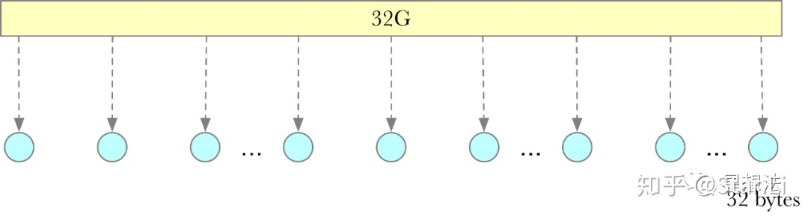
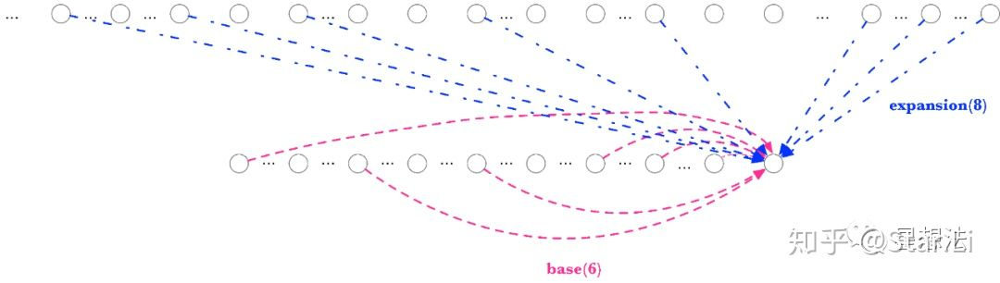
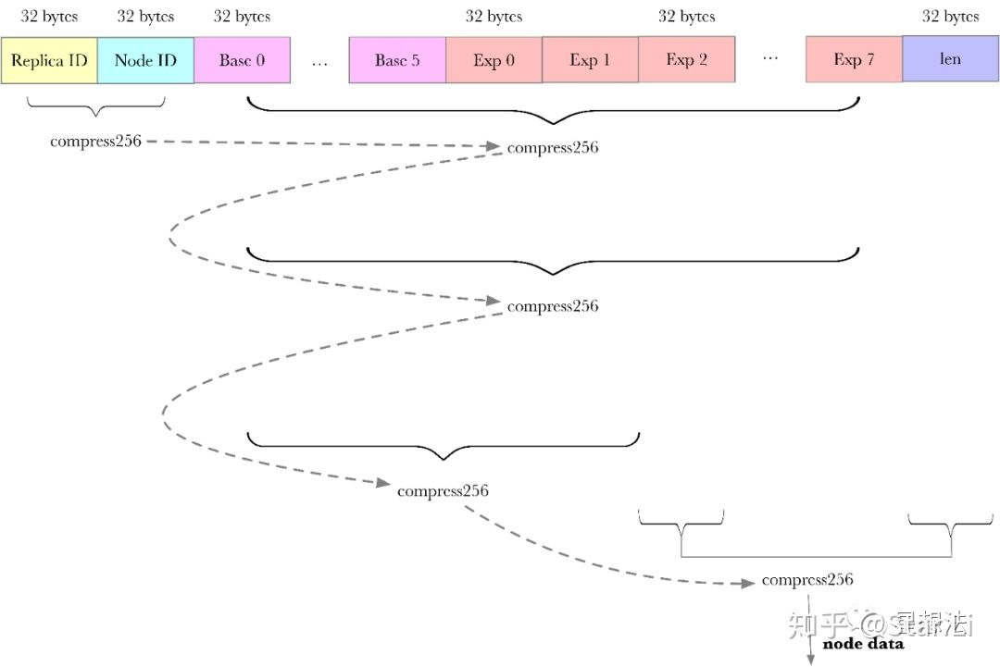

# 深入理解SDR算法

SDR的计算依赖6个自身节点和8个扩展节点。所有的11层的计算，一层一层，一个个的按顺序进行计算。Lotus源代码对目前的SDR的实现进行了一定的优化。
1) 依赖关系的cache，
2) 依赖节点的数据的预读取
3) sha256的加速。

Lotus的Sector处理的算法，从window SDR切换到了SDR。所谓的SDR，就是Stacked DRG (Depth Robust Graph，深度鲁棒图)。重点，就在于算法去掉了“window”。切换算法后，在intel的CPU上，Sector处理(Precommit phase1)阶段的时间非常长，超过了30个小时。Filecoin官方，推荐AMD的RX 3970x，Sector处理时间在4个小时左右。本文深入SDR的逻辑，分析Sector处理慢的原因。

## 回顾window SDR算法

回顾window SDR算法window SDR算法中的window，就是每个Sector的数据，先分割成一个个128M的window。

一个32G的Sector会划分成256个window。window和window之间相互独立。每个window，单独进行SDR的计算(labeling encode)。总共需要做4层(layer)。也就是说，独立的window之间，做4层运算。层与层之间满足SDR的关系。

## SDR算法

SDR算法相对window SDR，SDR的算法更加简单和粗暴。一个Sector，再也不划分window。整个Sector，进行SDR的计算，并且计算11层。相关源代码从storage-proofs/src/porep/stacked/vanilla/proof.rs的generate_labels*函数开始。
计算SDR的过程，可以拆分为三步。
在计算SDR之前，整个Sector，每32个字节，分割成一个个的节点（node）。为什么要分割成节点，因为DRG。有了节点，才能按照图，确定节点和节点之间的关系。

Sector的数据处理分为11层，从上到下的话，上一层成为下一层的扩展（expansion）。在某一层的上的某个节点的和其他节点的依赖关系如下图：

一个节点依赖自身以及扩展的一些节点，其中自身依赖6个节点，扩展依赖8个节点。

1. 确定自身（base）依赖关系
   
   计算一层中的某个节点信息，必须要先计算出该节点在这一层上依赖哪些节点。核心逻辑在storage-proofs/src/drgraph.rs对应的BucketGraph结构的parents函数：

   简单的说：
   1) 依赖关系使用ChaCha20随机生成算法。
   2) 生成的依赖关系都是当前节点之前的节点。
   3) 依赖的节点可以重复。
   
2. 确定扩展（expansion）依赖关系
   
   在确定了自身依赖关系后，必须再确定扩展依赖关系，也就是该节点和上一层节点之间的依赖关系。第一层的计算比较特殊，没有扩展关系。核心逻辑在storage-proofs/src/porep/stacked/vanilla/graph.rs中StackedGraph结构的generate_expanded_parents函数：

   简单的说：
    1）依赖关系使用Feistel加密算法（充当随机数生成），具体的实现在storage-proofs/src/crypto/feistel.rs文件中。Feistel算法依赖blake2b算法。
    2）依赖可能是所有节点。
    Feistel计算的逻辑在storage-proofs/src/crypto/feistel.rs文件中。经过3层的Feistel结构的运算，可以认为计算结果是伪随机。

3. 计算新的节点信息

   再确定了自身依赖以及扩展依赖后，组织生成新节点需要的信息：
   
   具体逻辑可以查看storage-proofs/src/porep/stacked/vanilla/graph.rs的StackedGraph结构的copy_parents_data_inner_exp函数。

    所有进行compress256计算的数据分为四种：
    1) ID信息，包括replica ID和节点编号
    2) 自身依赖的节点数据
    3) 扩展依赖的节点数据
    4) 长度信息
   
    这四类数据的compress256的结果相互依赖，最后的输出结果即为新的节点的数据。compress256的计算采用的是sha256算法，具体的实现在sha2raw/src/sha256.rs文件中。

## SDR为什么这么慢？

SDR为什么这么慢？仔细观察每一层上的某个节点的数据，必须依赖自身的前面6个节点。也就是说，要计算出该节点的数据，必须先算出依赖的6个节点。而且这个自身的依赖是“均匀”的。两层含义，一是每个节点都依赖6个节点，二是如果每个节点独立运算，都需要把之前的所有节点计算一遍。总之在一层的计算上，必须一个个的按顺序进行计算。

除了自身依赖，还有扩展依赖。进行下一层的计算之前，上一层的计算都必须算好。这样的话，所有的11层的计算，一层一层，一个个的按顺序进行计算。

具体的计算是sha256算法。在Intel的CPU上，整个11层的计算超过30个小时。在AMD的TR 3970x的CPU上，整个11层的计算在4个小时左右。TR3970x快的一个重要原因是支持sha256 ni指令集。

## SDR算法的优化

SDR算法的优化整个SDR的计算可以分成几部分：
1) 依赖关系的计算 
2) 依赖节点的数据读取 
3) sha256计算。

依赖关系的计算，Lotus源代码已经给出了cache的实现。所有节点的依赖关系，并行提前算好存在cache中。相关的代码在storage-proofs/src/porep/stacked/vanilla/graph.rs的ParentCache结构相关的函数中。

依赖关系的cache，可以通过环境变量开启或者关闭：
FIL_PROOFS_MAXIMIZE_CACHING=1

依赖节点的数据读取，Lotus源代码也进行了prefetch优化。相关的逻辑在storage-proofs/src/porep/stacked/vanilla/graph.rs的prefetch函数中。

sha256计算，Lotus源代码给出了三种版本的计算：sha, asm以及portable。sha是sha ni指令集优化的版本，asm是汇编优化的版本，portable是跨平台的版本。相关的代码在sha2raw目录中。目前的代码能自动检测平台，自动选择性能最好的版本。
在这些优化的基础上，还是有一些优化思路的。

## 总结

SDR的计算依赖6个自身节点和8个扩展节点。所有的11层的计算，一层一层，一个个的按顺序进行计算。Lotus源代码对目前的SDR的实现进行了一定的优化，依赖关系的cache，依赖节点的数据的预读取以及sha256的加速。