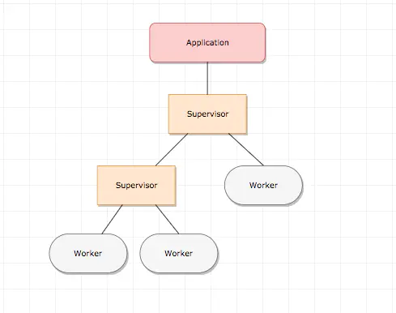

# 30 分钟学 Erlang

## 基本语法

### 基本类型

1. Numbers
2. 变量
   1. Erlang 里变量的命名有约定，必须首字母大写。
   2. Erlang 里没有赋值语句。= 在 Erlang 里是 pattern matching (匹配、模式匹配)，如果 = 左侧跟右侧的值不相等，就叫没匹配上，这时那个 erlang 进程会直接异常崩溃(不要害怕，erlang 里面崩溃挺正常的)。如果 = 左侧的变量还没有值，这次匹配过后，右侧的值就会 bind (绑定) 到那个变量上。

3. Atoms
   1. Erlang 里面有 atom 类型，atom 类型使用的内存很小，所以常用来做函数的参数和返回值。参加 pattern matching 的时候，运算也非常快速。
   2. 在一个 erlang vm 里，可创建的 atom 的数量是有限制的(默认是 1,048,576 )，因为erlang 虚拟机创建 atom 表也是需要内存的。一旦创建了某个 atom，它就一直存在那里了，不会被垃圾回收。不要在代码里动态的做 string -> atom 的类型转换，这样最终会使你的 erlang atom 爆表。

4. Boolean 以及比较
   1. atom 类型的 true 和 false 两个值，被用作布尔处理。
   2. 两个与 and 和 or 类似的操作：andalso 和 orelse。区别是 and 和 or 不论左边的运算结果是真还是假，都会执行右边的操作。而 andalso 和 orelse是短路的，意味着右边的运算不一定会执行。

5. Tuples
   1. Tuple 类型是多个不同类型的值组合成的类型。有点类似于 C 语言里的 struct。语法是：{Element1, Element2, ..., ElementN}
   2. 实践中，我们经常 在 tuple 的第一个值放一个 atom 类型，来标注这个 tuple 的含义。这种叫做 tagged tuple:

6. List
   1. Erlang 的 String 类型其实就是 List
   2. 当你知道你的数据结构有多少项的时候，用 Tuple；当你需要动态长度的数据结构时，用 List。
   3. 实践中我们经常会从一个 List 中，取出我们需要的那些元素，然后做处理，最后再将处理过的元素重新构造成一个新的元素。你马上就想到了 map，reduce。在 Erlang 里，我们可以用 List Comprehensions 语法，很方便的做一些简单的处理。

7. Anonymous functions
8. Modules
   1. Erlang 里代码是用 Module 组织的。一个 Module 包含了一组功能相近的函数。

9. Pattern Matching
   1. case clauses
   2. function clauses
10. Guards
11. Records
12. 递归和尾递归
    1. Erlang 是函数式语言，变量 immutable 的，所以没有 while loop。因为不能让你定义一个递增的 counter 变量。所以我们用递归来解决大多数问题。
    2. 尾递归就是，最后一个语句是调用自身的那种递归。Erlang 遇到这总递归的时候，不会再保留调用栈。这样的递归相当于一个 while loop。

## 并发

1. 创建进程
   1. 使用 erlang:spawn/1,2,3,4 用来创建一个 erlang 进程。Erlang 进程不是操作系统的进程，而是类似其他语言里“协程”的概念，它由 Erlang 虚拟机调度。
   2. 进程之间是互相独立的，一个进程要想与另外一个进程通信，就必须通过消息传递。消息会被发送到对方进程的信箱存储起来，对方进程可以在合适的时间，按照自定的顺序读取信箱里的消息。
   3. spawn 函数返回一个新进程的 pid，我们可以使用这个 pid 与其交互。
   4. 使用消息发送运算符 ! 发送消息。
   5. receive ... end 语句使用 pattern matching 来从自己进程的信箱里读取消息，可以使用 after 语句来设置等待超时时间
   6. Selective Message Reception. 消息的读取顺序是接收方决定的。
2. ETS
   1. ETS (Erlang Term Storage) 是设计来存放大量的 Erlang 数据的。跟 ETS 打交道不用消息格式转换，可直接存放 Erlang 数据格式 (erlang 各种数据格式的统称叫做 erlang terms)。ETS 非常快，访问时间是常数级的，自动帮你解决了多进程访问的各种竞态条件问题，让我们在 Erlang 中做并发编程一身轻松。ETS 是非常优秀的缓存系统，是我们开发中不可或缺的利器之一。这比起用某种流行语言来说，舒服太多[1]。ETS 只将数据存储在内存里，如果想保存到磁盘，或者要在多个 Erlang Node 之间共享数据，OTP 基于 ETS 和 DETS 实现了 mnesia.
   2. ETS 支持几种数据类型：
      1. set: set 是普通的 key - value 存储类型，一个 ETS table 里，两个数据的 key 不能相同。重复插入 key 相同的两条数据，后面的那条会覆盖前面的那条。
      2. ordered_set: 有序的 set 表。
      3. bag: bag 允许多个 key 相同的数据的存在，但 key, value 都完全相同的数据只能留一个。
      4. duplicate_bag: 允许多个 key, value 完全相同的数据的存在。
3. OTP
   1. Erlang 的逻辑是，架构的设计应该由有经验的人负责，由专家做好基础代码框架，解决好最困难的问题。而使用者只需要写自己的逻辑代码。这就是 OTP behaviors，他们已经在通信、互联网领域，经历了几十年的战火考验。
   2. gen_server 要解决的问题，就是我们上面那个 msg_cache 面临的问题：怎样做一个服务来响应用户的请求。
   3. gen_server 真正的进程代码在 OTP 库里，运行 start_link()，gen_server 就在后台跑起来了。你需要实现的只是这个模板里的各个回调函数，将你的业务逻辑放到这些回调里。

## 分布式

1. 一个 Erlang VM 是一个 Erlang Node。所以每次用 erl 命令启动一个 erlang shell，就是启动了一个 Node.我们有两种办法连接两个 Node。
   1. 第一种是显式的调用 net_kernel:connect_node/1，
   2. 第二种是在使用 RPC 调用一个远程的方法的时候，自动加入集群。
2. 分布式 Erlang 怎么工作的？
   1. 启动 erlang 的时候，系统会确保一个 epmd (erlang port mapping daemon) 已经起来了。
   2. epmd 工作的原理是：
      1. node1 监听在 52370 端口。
      2. 当 node2 尝试连接 node1@127.0.0.1 的时候，node2 首先去 127.0.0.1 机器上的 empd 请求一下，获得 node1 监听的端口号：52370。
      3. 然后 node2 使用一个临时端口号 52405 作为 client 端，与 node1 的 52370 建立了 TCP 连接。

## OTP 工程的基本框架

* 一个项目可以包含很多个 Application, 每个 application 包含了本应用的所有代码，可以随时加载和关闭。
* 一个 Application 一般会包含一个顶层 Supervisor 进程，这个顶层 Supervisor 下面管理了许多 sub Supervisor 和 worker 进程。
* Supervisor 是用来监控 worker 的, 我们的业务逻辑都在 worker 里面，supervisor 里可以定制重启策略，如果返现某个 worker 挂掉了，我们可以按照既定的策略重启它。
* 这个框架叫做 Supervision Tree.
  
Supervisor 可用的重启策略：

* one_for_all：如果一个子进程挂了，重启所有的子进程
* one_for_one：如果一个子进程挂了，只重启那一个子进程
* rest_for_one：如果一个子进程挂了，只重启那个子进程，以及排在那个子进程后面的所有子进程 (一个 supervisor 会按顺序启动很多子进程，排在一个子进程后面的叫 rest)。
* simple_one_for_one：当你想要动态的启动一个进程的多个实例时，用这个策略。比如来一个 socket 连接我们就启动一个 handler 进程，就适用于这种。
