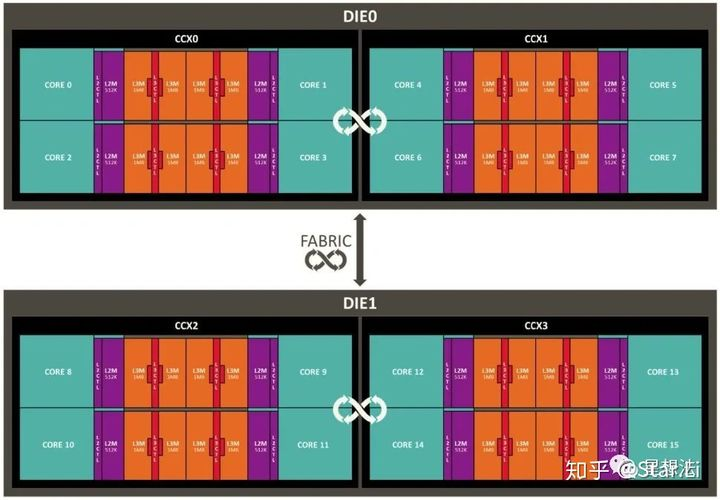

# CPU核心分配优化版使用说明

## Core Complex

CCX是AMD CPU架构的一个术语。CCX - CPU Core Complex。CCX指的是`一组CPU核心`和`缓存（L1/L2/L3）`。

CCD是AMD CPU架构的一个术语。CCD - Core Chiplet Die。CCD指的是一组CXX。

上图给一个示例。整个芯片由两个die组成（上面是die0，下面是die1）。每个Die（CCD）包括两个CCX。注意的是，每个core都有自己的L1/L2缓存，但是L3缓存是几个Core共享的。也就是说，在CCX的四个核可以共享L3缓存，如果四个核需要访问同一段数据，可以加速数据的访问时间。

## SDR算法优化思路

