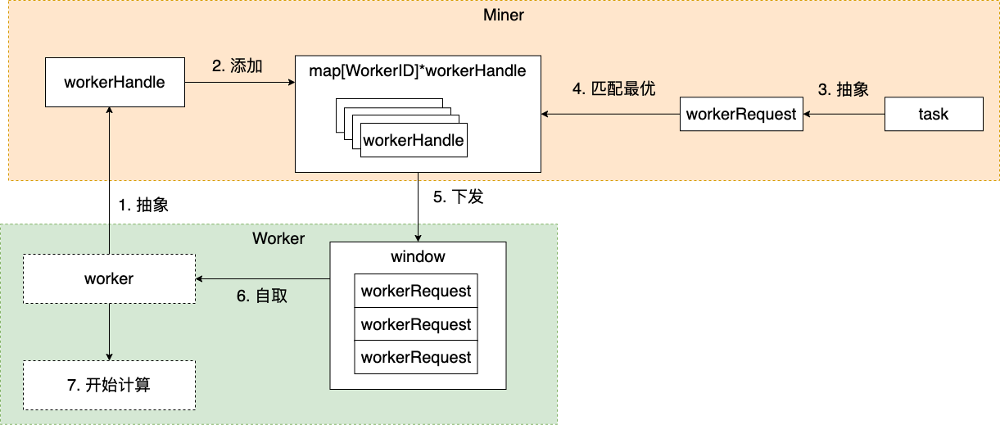
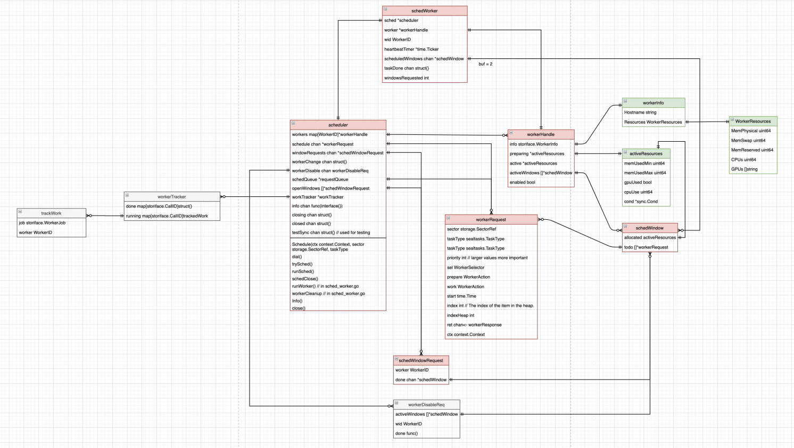

# myScheduler调度程序使用

## myScheduler 调度程序简介

目前官方窗口调度Scheduler工作效果不理想，有的worker工作繁忙，有的 worker 又非常轻闲。个人认为filecoin运维人员最为熟悉自己的设备，所以基于运维人员的工作任务指令，重新编写了一套调度程序，摈弃官方窗口调度和纯基于设备资源排序的规则，重新自定义排序规则，总体调度目标是让相关任务均匀分配到各个可以执行的 worker 上面，调度程序支持以下业务功能：

1. ① 支持90% 以上的设备利用率；
2. ② 由你的运维人员，设置每个 Worker 最大的 AP/P1/P2/C2 工作任务数量；
3. ③ 支持单 Worker 任意的 AP/P1/P2/C2 数量配比和工作并行；
4. ④ 支持单 Worker AP/P1 绑定（免传输32GB），P1/P2绑定（免传输453GB），P2/C2 绑定调度，如果三项全部绑定，则该 Worker 进入独立工作模式；
5. ⑤ 支持 Worker 待离线维护工作模式，不接新任务，完成手头任务后进行安全下线维护；
6. ⑥ 实时监控 Worker 本地 cache/sealed/unsealed 磁盘空间使用，当空间不足时，自动进入空间紧缩工作模式，支持 Worker 在 out of space 不接收任务工作分配情形下进行特别工作处理；
7. ⑦ 以上 Worker 参数，均可以在 Worker 运行过程中动态调整、实时生效；
8. ⑧ lotus-miner sectors mypledge 一次性填充所有 lotus-worker 可以工作AP的数量总和，可用自动化任务定时调用 mypledge

## lotus-worker 动态参数设置

如果首次启动 lotus-worker，调度程序会自动将 run 相关的参数写进 $LOTUS_WORKER_PATH 路径下面的参数文件 myscheduler.json， miner 本地worker，则是在 $LOTUS_MINER_PATH 目录创建此配置文件，并且设置为默认初始状态，相关参数均可以在不重启 lotus-worker 的状态下，动态修改并实时生效。以下是默认参数：

```shell
{
  "WorkerName": "",
  "AddPieceMax": 0,
  "PreCommit1Max": 0,
  "PreCommit2Max": 0,
  "Commit2Max": 0,
  "DiskHoldMax": 0,
  "APDiskHoldMax": 0,
  "ForceP1FromLocalAP": true,
  "ForceP2FromLocalP1": true,
  "ForceC2FromLocalP2": false,
  "IsPlanOffline": false,
  "AllowP2C2Parallel": false,
  "IgnoreOutOfSpace": false,
  "AutoPledgeDiff": 0
}
```

## 调度外部 lotus-worker 参数设置

myScheduler 社区版加入以下外部 lotus-worker 功能支持：

① 支持调度各类开源软件编译的 lotus-worker 优化版本；
② 支持调度外部 C2 的 lotus-worker 版本；
③ 支持调度外部阿里 FPGA卡的 lotus-worker P2优化版本；
④ 支持调度官方标准的 lotus-worker 等其它通用版本。 通过动态修改 $LOTUS_MINER_PATH 路径下面的 testOpenSource.json，可以控制被调度的 Worker 进行任意 AP/P1/P2/C2 数量配比和工作并行，以及 AP/P1/P2本地文件绑定不传输：

```shell
{
  "AddPieceMax": 1,
  "PreCommit1Max": 1,
  "PreCommit2Max": 1,
  "Commit2Max": 1,
  "ForceP1FromLocalAP": true,
  "ForceP2FromLocalP1": true,
  "ForceC2FromLocalP2": false,
  "AllowP2C2Parallel": true
}
```

## 自义定 pledge 任务实用工具

① `lotus-miner sectors mypledge mypledge` 一次性填充所有可以工作AP的 lotus-worker 的数量 AddPieceMax 总和，自动化任务可以定时调用 mypledge

② `lotus-miner sectors mypledgeonce mypledgeonce` 一次性为每个可以工作AP　的 lotus-worker 发送一个 AP，适合初始实施时，第一次使用 AP 模板复制功能。

## 调度过程日志分析与问题排查

由于调度的频繁度，在运行过程中，有大量的日志用于记录任务分配细节，可以通过下面的方式轻松查询相关成功分配和未分配的调度情况列表：

① more miner.log |grep -a trySchedMine > trySchedMine.txt， 这个里面记录了，所有成功调度的 has sucessfully scheduled 相关信息。
② more miner.log |grep -a "not scheduling" > not_scheduling.txt， 则是拒绝接收任务分配的worker 的日志。
③ 对于个别扇区的调度分配过程，则可以用以下方式查询和它相关的全部日志过程， more miner.log |grep -a "s-t0XXXX-YYYY"> s-t0XXXX-YYYY.txt ，格式是 "s-t0你的MinerID-某个扇区编号“。对于长时间不分配任务工作的 worker，一般是在 miner日志中可以看到 out of space 或者 didn't receive heartbeats for 的官方标准错误提醒。
④ 如果在 sealing workers 看到大量的 worker 闲置情况，但是挺多已经预分配的工作任务在 Preparing 里面，而长时间无法到在 Running。Preparing 通过了第一步的预备分配，在实际分配响应任务的时候不满足条件，就无法到达 Running 执行状态。尽量减少在动态参数配置文件中不必要的限制，限制条件越多，则越容易无法达到真正可运行状态。有时可以偿试进行一次 lotus-miner sectors mypledgeonce 触发新一轮的 AP 分配和调度。
下面的三种 miner 日志，存在任何一种，都表示这个 worker 不会接收任何工作任务：

```shell
cat miner.log |grep -a "didn't receive heartbeats for"|awk '{print $8}'|sort -rn|uniq -c

cat miner.log |grep -a "out of space "|awk '{print $8}'|sort -rn|uniq -c

cat miner.log |grep -a "trySchedMine skipping disabled worker "|awk '{print $9}'|sort -rn|uniq -c
```

对于这种 disabled worker 状态又不是断连，从调度程序的角度来看，disabled worker 和 out of space 一样的，不接收工作，更像是假死，而且 disabled 和 enabled 是互相动态变化的。

## lotus 是怎么调度任务的？

### lotus 任务调度要解决的主要问题

它想要解决的主要问题包括：

1. 实现任务绑定配置化。通过启动参数，可以灵活配置 worker 执行的任务种类，方便矿工进行灵活的集群架构调整，并实现集群机器数量的伸缩性；
2. 根据硬件资源分发任务。不同配置的 worker 能够并行执行的任务数量也不相同，超过硬件承受能力的任务分配会导致硬件资源争用，进而导致任务执行时间直线下降。同时要均匀分配负载，不能让忙的忙死，闲的闲死；
3. 兼容各种异常情况。例如当发生 worker 或 miner 突然掉线、网络不畅、存储空间不足等情况时，要能够保证异常状态的任务不会陷入死循环中，能够在合适的时间重启或继续，并且不影响正常状态任务的执行。

在实际使用中发现，尽管第二和第三个问题解决的不尽完美，但当前的方案已经基本适应了大多数场景。

### 调度核心流程



如上图所示：

1. worker 启动后，会通过 RPC 连接 miner，miner 收到并通过 JWT 验证后，会将其抽象为一个 `workerHandle` 对象，主要记录 worker 的基本信息，如资源使用情况、当前任务情况等；
2. workerHandle 对象会添加到名为 `worker 的 map` 中，用于后续任务调度时匹配；
3. 新增的 task 会抽象为 `workerRequest`，并添加到 miner 的任务队列中；
4. 这一步是调度的核心。将所有待调度的 task 依次寻找最优的 workerHandle，目前的实现主要参考`任务优先级`、`worker 空闲情况`、worker 每一个任务分配时需要预留的资源定义在 extern/sector-storage/resources.go文件中，如 32G 扇区需要预留资源如下：
    |任务类型 |MaxMemory |MinMemory |最大并行数 |BaseMinMemory |canGPU|
    |---|---|---|---|---|---|
    |P1 |64GB |56GB |不可并行 |10MB|
    |P2 |15GB |15GB |可并行 |1GB |true|
    |C1 |1GB |1GB |未定义 |1GB|
    |C2 |150GB |30GB |可并行 |32GB |true|
5. 匹配好 worker 的 task 下发到对应的 worker 上，worker 同时维护多个任务 window（类似 queue），用于保存及调度所有正在运行及待运行的任务；
6. worker 定期会到 window 中取出任务进行执行；
7. 执行任务计算。

### 基本数据结构



图中红色部分负责核心调度，绿色为资源管理，灰色负责状态同步记录。
核心数据结构包括：

* scheduler：调度器，负责在 miner 上统筹调度所有task及worker。核心调度方法是 trySched()
* workerHandle: worker 的抽象，记录 worker 基本信息、当前资源使用、worker 的任务 window 等
* workerRequest: task 的抽象，记录任务类型、优先级以及任务的具体执行内容等
* activeResources: 正在使用的资源
* workerResources: worker 总的资源

### 扇区状态流转

扇区的某个任务执行完成后，会通过一个有限状态机来更新任务状态，并将自动添加下一步任务给到 scheduler 中。有限状态机的代码位于：extern/storage-sealing/fsm.go，具体状态机见代码注释，如下：

```shell
 /*

                *   Empty <- incoming deals
                |   |
                |   v
                *<- WaitDeals <- incoming deals
                |   |
                |   v
                *<- Packing <- incoming committed capacity
                |   |
                |   v
                |   GetTicket
                |   |   ^
                |   v   |
                *<- PreCommit1 <--> SealPreCommit1Failed
                |   |       ^          ^^
                |   |       *----------++----\
                |   v       v          ||    |
                *<- PreCommit2 --------++--> SealPreCommit2Failed
                |   |                  ||
                |   v          /-------/|
                *   PreCommitting <-----+---> PreCommitFailed
                |   |                   |     ^
                |   v                   |     |
                *<- WaitSeed -----------+-----/
                |   |||  ^              |
                |   |||  \--------*-----/
                |   |||           |
                |   vvv      v----+----> ComputeProofFailed
                *<- Committing    |
                |   |        ^--> CommitFailed
                |   v             ^
                |   SubmitCommit  |
                |   |             |
                |   v             |
                *<- CommitWait ---/
                |   |
                |   v
                |   FinalizeSector <--> FinalizeFailed
                |   |
                |   v
                *<- Proving
                |
                v
                FailedUnrecoverable

                UndefinedSectorState <- ¯\_(ツ)_/¯
                    |                     ^
                    *---------------------/

    */
```

了解到这个状态变化，结合 lotus-miner sectors list 和 lotus-miner sectors status --log sector_id 就可以定位扇区异常状态及能否恢复了。

### 举个定制的例子

了解了上面这些，结合代码，基本上就可以按照自己的需求修改代码了，下面举一个简单的例子。
假设我们想要手工限制某台机器 P1 任务的执行数量为 N，结合上面的调度流程，我们只需要修改下调度过程中workerRequest 与 workerHandle 的匹配流程。实现思路就是在匹配的时候，将当前 worker 正在执行的 P1 任务数量与预先设置的阈值 N 进行比较，若大于等于 N，则不再调度给该 worker。那么， 要在哪里添加这部分逻辑呢？
首先需要了解清楚调度的核心代码。这部分代码位于 extern/sector-storage/sched.go 的 trySched()方法中，代码中有一些我补充的中文注释，便于理解：

```go
func (sh *scheduler) trySched() {
    /*
        This assigns tasks to workers based on:
        - Task priority (achieved by handling sh.schedQueue in order, since it's already sorted by priority)
        - Worker resource availability
        - Task-specified worker preference (acceptableWindows array below sorted by this preference)
        - Window request age

        1. For each task in the schedQueue find windows which can handle them
        1.1. Create list of windows capable of handling a task
        1.2. Sort windows according to task selector preferences
        2. Going through schedQueue again, assign task to first acceptable window
           with resources available
        3. Submit windows with scheduled tasks to workers

    */

    sh.workersLk.RLock()
    defer sh.workersLk.RUnlock()

    windowsLen := len(sh.openWindows)
    queuneLen := sh.schedQueue.Len()

    log.Debugf("SCHED %d queued; %d open windows", queuneLen, windowsLen)

    // 如何没有调度任务、或者没有 window，返回
    if windowsLen == 0 || queuneLen == 0 {
        // nothing to schedule on
        return
    }

    windows := make([]schedWindow, windowsLen) // 按照 open windows 的数量创建 windows
    acceptableWindows := make([][]int, queuneLen) // 按照待完成任务数量，创建 acceptableWindows, 是一个二维数组，第一维是任务，第二维是能完成该任务的 window 按照优先级排列

    // Step 1
    // 为schedQueue中的每个任务找到可以处理它们的窗口。
    throttle := make(chan struct{}, windowsLen)

    var wg sync.WaitGroup
    wg.Add(queuneLen) // 保证所有任务都遍历完成

    // 遍历所有待分配的任务
    for i := 0; i < queuneLen; i++ {
        throttle <- struct{}{}

        go func(sqi int) {
            defer wg.Done()
            defer func() {
                <-throttle
            }()

            task := (*sh.schedQueue)[sqi]
            // 获取到任务需要的资源
            needRes := ResourceTable[task.taskType][task.sector.ProofType]

            task.indexHeap = sqi
            // 遍历所有worker 的 open window
            for wnd, windowRequest := range sh.openWindows {
                worker, ok := sh.workers[windowRequest.worker]
                if !ok {
                    log.Errorf("worker referenced by windowRequest not found (worker: %s)", windowRequest.worker)
                    // TODO: How to move forward here?
                    continue
                }

                if !worker.enabled {
                    log.Debugw("skipping disabled worker", "worker", windowRequest.worker)
                    continue
                }

                // TODO: allow bigger windows
                if !windows[wnd].allocated.canHandleRequest(needRes, windowRequest.worker, "schedAcceptable", worker.info.Resources) {
                    continue
                }

                rpcCtx, cancel := context.WithTimeout(task.ctx, SelectorTimeout)
                ok, err := task.sel.Ok(rpcCtx, task.taskType, task.sector.ProofType, worker)
                cancel()
                if err != nil {
                    log.Errorf("trySched(1) req.sel.Ok error: %+v", err)
                    continue
                }

                if !ok {
                    continue
                }

                // 一切验证通过，加入备选
                acceptableWindows[sqi] = append(acceptableWindows[sqi], wnd)
            }

            if len(acceptableWindows[sqi]) == 0 {
                return
            }

            // Pick best worker (shuffle in case some workers are equally as good)
            rand.Shuffle(len(acceptableWindows[sqi]), func(i, j int) {
                acceptableWindows[sqi][i], acceptableWindows[sqi][j] = acceptableWindows[sqi][j], acceptableWindows[sqi][i] // nolint:scopelint
            })
            sort.SliceStable(acceptableWindows[sqi], func(i, j int) bool {
                wii := sh.openWindows[acceptableWindows[sqi][i]].worker // nolint:scopelint
                wji := sh.openWindows[acceptableWindows[sqi][j]].worker // nolint:scopelint

                if wii == wji {
                    // for the same worker prefer older windows
                    return acceptableWindows[sqi][i] < acceptableWindows[sqi][j] // nolint:scopelint
                }

                wi := sh.workers[wii]
                wj := sh.workers[wji]

                rpcCtx, cancel := context.WithTimeout(task.ctx, SelectorTimeout)
                defer cancel()

                // 按照资源空闲情况排序，越空闲，排到越前面
                r, err := task.sel.Cmp(rpcCtx, task.taskType, wi, wj)
                if err != nil {
                    log.Errorf("selecting best worker: %s", err)
                }
                
                return r
            })
        }(i)
    }

    wg.Wait()

    log.Debugf("SCHED windows: %+v", windows)
    log.Debugf("SCHED Acceptable win: %+v", acceptableWindows)

    // Step 2
    // 再次遍历 schedQueue，将任务分配到第一个可接受的窗口，按照资源空闲程度排序。
    scheduled := 0
    rmQueue := make([]int, 0, queuneLen)

    for sqi := 0; sqi < queuneLen; sqi++ {
        // 待分配的任务
        task := (*sh.schedQueue)[sqi]

        // 获得该任务所需资源
        needRes := ResourceTable[task.taskType][task.sector.ProofType]

        selectedWindow := -1
        for _, wnd := range acceptableWindows[task.indexHeap] {
            wid := sh.openWindows[wnd].worker
            wr := sh.workers[wid].info.Resources

            log.Debugf("SCHED try assign sqi:%d sector %d to window %d", sqi, task.sector.ID.Number, wnd)

            // TODO: allow bigger windows
            if !windows[wnd].allocated.canHandleRequest(needRes, wid, "schedAssign", wr) {
                continue
            }

            log.Debugf("SCHED ASSIGNED sqi:%d sector %d task %s to window %d", sqi, task.sector.ID.Number, task.taskType, wnd)

            windows[wnd].allocated.add(wr, needRes)
            // TODO: We probably want to re-sort acceptableWindows here based on new
            //  workerHandle.utilization + windows[wnd].allocated.utilization (workerHandle.utilization is used in all
            //  task selectors, but not in the same way, so need to figure out how to do that in a non-O(n^2 way), and
            //  without additional network roundtrips (O(n^2) could be avoided by turning acceptableWindows.[] into heaps))

            selectedWindow = wnd
            if task.taskType == sealtasks.TTAddPiece {
                taskAssignRecord[uint64(task.sector.ID.Number)] = sh.workers[wid].info.Hostname
            }
            break
        }

        if selectedWindow < 0 {
            // all windows full
            continue
        }

        windows[selectedWindow].todo = append(windows[selectedWindow].todo, task)

        rmQueue = append(rmQueue, sqi)
        scheduled++
    }

    if len(rmQueue) > 0 {
        for i := len(rmQueue) - 1; i >= 0; i-- {
            sh.schedQueue.Remove(rmQueue[i])
        }
    }
    
    // Step 3
    // Submit windows with scheduled tasks to workers
    if scheduled == 0 {
        return
    }

    scheduledWindows := map[int]struct{}{}
    for wnd, window := range windows {
        if len(window.todo) == 0 {
            // Nothing scheduled here, keep the window open
            continue
        }

        scheduledWindows[wnd] = struct{}{}

        window := window // copy
        select {
        case sh.openWindows[wnd].done <- &window:
        default:
            log.Error("expected sh.openWindows[wnd].done to be buffered")
        }
    }

    // Rewrite sh.openWindows array, removing scheduled windows
    newOpenWindows := make([]*schedWindowRequest, 0, windowsLen-len(scheduledWindows))
    for wnd, window := range sh.openWindows {
        if _, scheduled := scheduledWindows[wnd]; scheduled {
            // keep unscheduled windows open
            continue
        }

        newOpenWindows = append(newOpenWindows, window)
    }

    sh.openWindows = newOpenWindows
}
```

lotus 调度任务的整体逻辑基本还是遵循生产者-消费者模型，通过对 worker、task 的抽象，结合预配置、资源情况、优先级等因素进行调度，并通过一个有限状态机控制状态流转。

