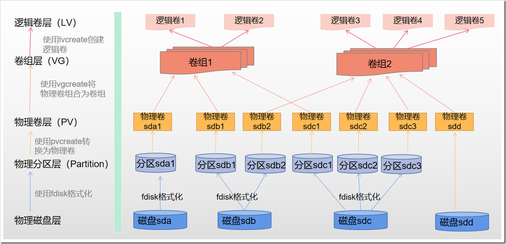

# Linux 物理卷(PV)、逻辑卷(LV)、卷组(VG)管理



## 为什么要使用逻辑卷

对于物理磁盘，我们直接分区、格式化为文件系统之后就可以使用，那为什么还需要使用逻辑卷的方式来管理磁盘呢？我认为主要有2个原因：

* 业务上使用大容量的磁盘。举个例子，我们需要在/data下挂载30TB的存储，对于单个磁盘，是无法满足要求的，因为市面上没有那么大的单块磁盘。但是如果我们使用逻辑卷，将多个小容量的磁盘聚合为一个大的逻辑磁盘，就能满足需求。
* 扩展和收缩磁盘。在业务初期规划磁盘时，我们并不能完全知道需要分配多少磁盘空间是合理的，如果使用物理卷，后期无法扩展和收缩，如果使用逻辑卷，可以根据后期的需求量，手动扩展或收缩。

## 创建物理卷（PV）

通过上面的逻辑卷架构图，可以知道，如果要创建逻辑卷，需要先有物理磁盘或者磁盘分区，然后使用物理磁盘或磁盘分区创建物理卷，再使用物理卷创建卷组，最后使用卷组创建逻辑卷。接下来一步一步创建逻辑卷。

创建物理卷是创建逻辑卷的第一步，创建物理卷相关命令有：

```shell
# pvcreate用于创建物理卷
pvcreate /dev/sdb

# pvdisplay、pvsca、pvs用于查看物理卷
pvdisplay
pvs
pvscan
```

可以使用磁盘直接创建物理卷，也可以使用磁盘分区创建物理卷。两种方法稍微有些差距，下面进行说明。

### 使用磁盘直接创建物理卷

直接使用物理磁盘创建物理卷没有什么需要特别注意的，直接创建即可。

```shell
# 使用fdisk -l确认磁盘，可以看到/dev/sdb未做分区处理
[root@masterdb ~]# fdisk -l /dev/sdb

Disk /dev/sdb: 2147 MB, 2147483648 bytes, 4194304 sectors
Units = sectors of 1 * 512 = 512 bytes
Sector size (logical/physical): 512 bytes / 512 bytes
I/O size (minimum/optimal): 512 bytes / 512 bytes
# 使用pvcreate将sdb磁盘创建为物理卷
[root@masterdb ~]# pvcreate /dev/sdb
  Physical volume "/dev/sdb" successfully created.
# 使用pvdisplay确认物理卷信息
[root@masterdb ~]# pvdisplay 
  --- Physical volume ---
  PV Name               /dev/sda3
  VG Name               centos
  PV Size               <68.73 GiB / not usable 4.00 MiB
  Allocatable           yes (but full)
  PE Size               4.00 MiB
  Total PE              17593
  Free PE               0
  Allocated PE          17593
  PV UUID               FRxq7G-1XWu-dPeW-wEwO-322y-M9XR-0ExebA
   
  "/dev/sdb" is a new physical volume of "2.00 GiB"
  --- NEW Physical volume ---
  PV Name               /dev/sdb
  VG Name               
  PV Size               2.00 GiB
  Allocatable           NO
  PE Size               0   
  Total PE              0
  Free PE               0
  Allocated PE          0
  PV UUID               nsL75f-o3fD-apyz-SSY0-miUi-4RYf-zVLIT6
   # 也可以使用pvs确认物理卷信息,不过能够看到的信息比pvdisplay少
[root@masterdb ~]# pvs 
  PV         VG     Fmt  Attr PSize  PFree
  /dev/sda3  centos lvm2 a--  68.72g    0 
  /dev/sdb          lvm2 ---   2.00g 2.00g
[root@masterdb ~]#

```

### 使用磁盘分区创建物理卷

磁盘分区之后，磁盘id为83，如果要使用逻辑卷管理，需要将id改为8e，才能创建物理卷。

## 创建、扩容卷组

### 创建卷组

有了PV就可以创建卷组了，创建卷组相关命令有：

```shell
# 使用vgcreate创建卷组
vgcreate VG_NAME device1 ... devicen

# 使用vgdosplay、vgscan、vgs命令查看卷组
vgdisplay
vgscan
vgs
```

### 扩容卷组

如果在使用过程中，发现要使用的空间大于卷组的空间，可以对卷组进行扩容，把新的物理卷(PV)加入到卷组中，语法为

```shell
vgextend VG_NAME device1 ... devicen
```

## 创建、扩容逻辑卷

### 创建逻辑卷

```shell
# 使用lvcreate创建逻辑卷lvcreate –L SIZE –n LV_NAME VG_NAME

使用lvdisplay、lvscan、lvs查看逻辑卷
lvdisplay
lvscan
lvs
```

### 扩容逻辑卷

使用如下命令进行扩容

```shell
# 使用lvextend扩容lv，+SIZE代表增加的空间
lvextend -L +SIZE lv_device

# 调整文件系统的大小
resize2fs device lv_device
```
